## ch01 CMake 是什么?

#### 例子

**CMakeLists.txt**

```cmake
cmake_minimum_required(VERSION 3.23 FATAL_ERROR)
project(study_cmake
        VERSION 0.0.1
        DESCRIPTION "cmake study project"
        HOMEPAGE_URL "eglinux.com"
        LANGUAGES CXX C
        )

list(APPEND CMAKE_MESSAGE_CONTEXT Top)
set(CMAKE_EXPORT_COMPILE_COMMANDS ON)
message("======================== temp test start ====================================")
add_executable(main src/main.cpp)
message("======================== temp test end ======================================")
```

**src/main.cpp**

```cpp
#include <iostream>
using namespace std;
int main(int argc, const char* argv[]) {
    std::cout << "Hello C++ " << __cplusplus << std::endl;
    return 0;
}
```


## ch02 Linux 安装 CMake
## ch03 Windows 安装 CMake
## ch04 macOS 安装 CMake
## ch05 CMake 开发环境搭建
## ch06 CMake 命令介绍
## ch07 CMake 交互界面介绍
## ch08 使用 CMake 构建第一个 CMake 项目

**spdlog** 构建日志库项目

```sh
cmake -DSPDLOG_BUILD_TESTS=ON -DCMAKE_BUILD_TYPE=Debug   -S . -B build_debug
cmake --build build_debug
cd build_debug
ctest 
# 打TGZ 和 zip包
cpack
# 打deb包
cpack -G DEB
# 打rpm包
sudo apt install rpm
cpack -G RPM
# 解压deb包
dpkg -X spdlog-1.10.0.deb .
dpkg -e spdlog-1.10.0.deb .
```


## ch09 一个最小的 CMakeLists.txt

```cmake
cmake_minimum_required(VERSION 3.23)
project(study_cmake)
```


## ch10 理解 CMake 的构建过程


## ch11 什么是源码目录和构建目录以及源内构建和源外构建


## ch12 CMake 命令之 project()

```cmake
# project的变量
PROJECT_NAME # 项目名
CMAKE_PROJECT_NAME # 顶级项目名

# 项目源码的目录
PROJECT_SOURCE_DIR 
ch12_demo_SOURCE_DIR 

# 项目构建的目录
PROJECT_BINARY_DIR 
ch12_demo_BINARY_DIR 

# 是否顶级项目
PROJECT_IS_TOP_LEVEL
ch12_demo_IS_TOP_LEVEL

# 版本号
message("version : ${CMAKE_PROJECT_VERSION}")
message("version : ${CMAKE_PROJECT_VERSION_TWEAK}")
message("version : ${PROJECT_VERSION}")
message("version : ${PROJECT_VERSION_MAJOR}")
message("version : ${PROJECT_VERSION_MINOR}")
message("version : ${PROJECT_VERSION_PATCH}")
message("version : ${PROJECT_VERSION_TWEAK}")

# 项目说明
PROJECT_DESCRIPTION, <PROJECT-NAME>_DESCRIPTION
# 项目主页
PROJECT_HOMEPAGE_URL, <PROJECT-NAME>_HOMEPAGE_URL
```


## ch13 CMake 变量之普通变量

```cmake
# 可以多个值，分隔符默认空格和分号
set(myVar a b c d)
list(LENGTH myVar outVar)
message("myVar=${myVar}  myVar length=${outVar}")
```

```cmake
#### 常见的变量定义 ###############
message("####################")
set(foo ab)                 # ab
message("foo=${foo}")
set(bar ${foo}cd)           # abcd
message("bar=${bar}")
set(baz ${foo} cd)          # ab;cd
message("baz=${baz}")
set(myVar ba)               # ba
message("myVar=${myVar}")
set(big "${${myVar}r}ef")   # abcdef
message("big=${big}")
set(${foo} xyz)             # set(ab xyz), ab=xyz
message("${foo}=${${foo}}")
# 打印not_define
set(bar ${not_define})
message("bar=${bar}")
```

**多行打印**

```cmake
set(myVar "goes here")
set(multline "First line ${myVar}
Second line with a \"quoted\" word")
message("${multline}")

#####################################
set(myVar "goes here")
# 原生字符串：[=[asdf]=]，零到无数个等号
set(multline [==[First line ${myVar}
Second line with a "quoted" word"]==])
message("${multline}")
```

**取消变量**

```cmake
unset(multline)
```

## ch14 CMake 命令之 lists()

#### 读取列表

```cmake
set(my_list a b c d e)

# 读取列表长度
list(LENGTH my_list len)
message("len=${len}")

# 读取元素
list(GET my_list 0 1 elem)
message("elem=${elem}")

# 粘连列表
list(JOIN my_list - out_var)
message("out_var=${out_var}")

# 子列表
list(SUBLIST my_list 1 3 out_var)
message("out_var=${out_var}")
```


#### 搜索列表

```cmake
set(my_list a b c d e)
list(FIND my_list d out_var) # 找不到返回-1，找到返回下标
message("out_var=${out_var}")
```


#### 修改列表

```cmake
# 追加元素
set(my_list a b c d e)
# list(APPEND <list> [<element> ...])
list(APPEND my_list 1 2;3 4)
message("my_list=${my_list}")

# 正则表达式
set(my_list a b c d e)
# list(FILTER <list> <INCLUDE|EXCLUDE> REGEX <regular_expression>)
list(FILTER my_list INCLUDE REGEX [0-9])
message("my_list=${my_list}")

# 插入元素
set(my_list a b c d e)
# list(INSERT <list> <element_index> <element> [<element> ...])
list(INSERT my_list 0 @ * & )
message("my_list=${my_list}")

# 弹出元素
set(my_list a b c d e)
# list(POP_BACK <list> [<out-var>...])
list(POP_BACK my_list ele1 ele2)
message("${ele1} ${ele2}")
# list(POP_FRONT <list> [<out-var>...])
list(POP_FRONT my_list ele1 ele2)
message("${ele1} ${ele2}")

# 头部追加
set(my_list a b c d e)
# list(PREPEND <list> [<element> ...])
list(PREPEND my_list ele1 ele2)
message("${my_list}")

# 移除元素
set(my_list a b c d e)
# list(REMOVE_ITEM <list> <value> [<value> ...])
list(REMOVE_ITEM my_list a b)
message("${my_list}")
# list(REMOVE_AT <list> <index> [<index> ...])
list(REMOVE_AT my_list 0 1)
message("${my_list}")
# list(REMOVE_DUPLICATES <list>)
# 删除重复元素
set(mylist a a b b c c d d)
list(REMOVE_DUPLICATES mylist)
message("${mylist}")

# 转换
#list(TRANSFORM <list> <ACTION> [<SELECTOR>] [OUTPUT_VARIABLE <output variable>])
set(MY_LIST 1 2 3 4 5 6 7 8 9)
list(TRANSFORM MY_LIST PREPEND  he-)
list(TRANSFORM MY_LIST APPEND  0)
message("${MY_LIST}")

set(my_list a Bb c dD e Ff)
list(TRANSFORM my_list TOLOWER )
message("${my_list}")

list(TRANSFORM my_list APPEND "x" FOR 2 5 1 OUTPUT_VARIABLE A_out)
message("${A_out}")
message("${my_list}")
```


#### 排序列表

```CMAKE
list(REVERSE <list>)
```

逆序本列表

```cmake
list(SORT <list> [COMPARE <compare>] [CASE <case>] [ORDER <order>])
```

排序列表。

**`COMPARE` 选择排序方法，`<compare>` 选择以下之一:**

- `STRING`: 默认，按字母顺序对字符串进行排序。

- `FILE_BASENAME`: 按文件路径的基本名称进行排序。

- `NATURAL`: 按数值大小进行排序。

**`CASE` 选择排序时是否区分大小写。`<case>` 选择以下之一:**

- `SENSITIVE`: 默认，对大小写敏感，区分大小写

- `INSENSITIVE`: 对大小写不敏感，不区分大小写

**`ORDER` 用于控制排序。`<orde>` 选择以下之一:**

- `ASCENDING`: 默认，升序排序。

- `DESCENDING`: 降序排序。


## ch15 CMake变量之缓存变量

```cmake
# 第一种定义方式
set(<variable> <value>... CACHE <type> <docstring> [FORCE])
# 第二种定义方式
option(is_top OFF "is top dir")
```

支持的类型：

- `BOOL`

  Boolean `ON/OFF` value.

- `FILEPATH`

  Path to a file on disk.

- `PATH`

  Path to a directory on disk.

- `STRING`

  A line of text.

- `INTERNAL`(很少使用，忽略)

  A line of text.


**例子**

```cmake
# set(<variable> <value>... CACHE <type> <docstring> [FORCE])
# 布尔变量
set(PRINT_HELLO ON CACHE BOOL "is print hello" FORCE)
if (PRINT_HELLO)
    message("PRINT_HELLO:${PRINT_HELLO}")
endif ()

set(AA /USR /OPT CACHE PATH "is print hello" FORCE)
message("${AA}")
```


## ch16 C Make中属性的概念

这节只对属性有感性的认识

```cmake
set_property(GLOBAL PROPERTY study_cmake_path "/home/eglinux/")
get_property(out_var GLOBAL PROPERTY study_cmake_path)
message("${out_var}")
```

## ch17 CMake 流程控制之判断条件和if()命令

```CMAKE
set(var ON)
if (var)
    message("真")
else()
    message("假")
endif ()

# 判断命令、函数和宏是否存在
if (COMMAND cmake_minimum_required)
    message("真")
else()
    message("假")
endif ()

# 判断目标是否存在
if (TARGET ch17_if_judge)
    message("真")
else()
    message("假")
endif ()

# 判断测试是否存在
add_test(test1 1)
if (TEST test1)
    message("真")
else()
    message("假")
endif ()

# 判断变量是否存在
set(var ON)
if (DEFINED var)
    message("真")
else()
    message("假")
endif ()

#######################################
# 文件操作
# 判断文件或者文件夹存在否
if (EXISTS [[C:\Users\1\Documents\workspaces\clion-and-cmake\cmake\cmake best practice\cmake-code-example]])
    message("真")
else()
    message("假")
endif ()

# 判断两个文件，哪个更新
if ("${PROJECT_SOURCE_DIR}/CMakeLists.txt" IS_NEWER_THAN "${PROJECT_SOURCE_DIR}/main.cpp")
    message("真")
else()
    message("假")
endif ()

if ("${PROJECT_SOURCE_DIR}/main.cpp" IS_NEWER_THAN "${PROJECT_SOURCE_DIR}/CMakeLists.txt")
    message("真")
else()
    message("假")
endif ()

# 是否是一个文件夹
if (IS_DIRECTORY ${PROJECT_SOURCE_DIR}/CMakeLists.txt)
    message("真")
else()
    message("假")
endif ()

# 是否是一个符号链接
if (IS_SYMLINK ${PROJECT_SOURCE_DIR}/CMakeLists.txt)
    message("真")
else()
    message("假")
endif ()

# 是否是一个符号链接
if (IS_ABSOLUTE ${PROJECT_SOURCE_DIR}/CMakeLists.txt)
    message("真")
else()
    message("假")
endif ()

# 是否是一个符号链接
if ("123" MATCHES "[0-9]")
    message("真")
else()
    message("假")
endif ()

# 比较
if(<variable|string> LESS <variable|string>)
if(<variable|string> GREATER <variable|string>)
if(<variable|string> EQUAL <variable|string>)
if(<variable|string> LESS_EQUAL <variable|string>)
if(<variable|string> GREATER_EQUAL <variable|string>)
if(<variable|string> STRLESS <variable|string>)
if(<variable|string> STRGREATER <variable|string>)
if(<variable|string> STREQUAL <variable|string>)
if(<variable|string> STRLESS_EQUAL <variable|string>)
if(<variable|string> STRGREATER_EQUAL <variable|string>)

# 比较版本号
if(<variable|string> VERSION_LESS <variable|string>)
if(<variable|string> VERSION_GREATER <variable|string>)
if(<variable|string> VERSION_EQUAL <variable|string>)
if(<variable|string> VERSION_LESS_EQUAL <variable|string>)
if(<variable|string> VERSION_GREATER_EQUAL <variable|string>)
```

## ch18 CMake 流程控制之while()命令

```cmake
set(MYVAR 0)
while (MYVAR LESS 5)
    math(EXPR MYVAR "${MYVAR}+1")
    if (MYVAR EQUAL 3)
        continue()
    endif ()
    message(STATUS "MYVAR is '${MYVAR}'")
endwhile ()

set(MYVAR 0)
while (MYVAR LESS 5)
    math(EXPR MYVAR "${MYVAR}+1")
    if (MYVAR EQUAL 3)
        break()
    endif ()
    message(STATUS "MYVAR is '${MYVAR}'")
endwhile ()
```


## ch19 CMake 流程控制之 foreach0 命令

```cmake
foreach (var RANGE 10)
    message("var=${var}")
endforeach ()

foreach (var RANGE 0 100 10)
    message("var=${var}")
endforeach ()

set(A 0;1)
set(B 2 3)
set(C "4 5")
set(D 6;7 8)
set(E "")
foreach(X IN LISTS A B C D E)
    message(STATUS "X=${X}")
endforeach()

########################################
list(APPEND English one two three four)
list(APPEND Bahasa satu dua tiga)

foreach(num IN ZIP_LISTS English Bahasa)
    message(STATUS "num_0=${num_0}, num_1=${num_1}")
endforeach()

foreach(en ba IN ZIP_LISTS English Bahasa)
    message(STATUS "en=${en}, ba=${ba}")
endforeach()
```

## ch20 CMake 如何定义函数

```cmake
function(my_fun sss tttt)
    message("sss=${sss}")
    message("tttt=${tttt}")
endfunction()
my_fun("asdf" "123")
```


## ch21 CMake 如何定义宏以及宏与函数的区别

```cmake
# 函数与宏的主要差别就是函数引入新的作用域，宏没有引入新的作用域
function(my_fun sss tttt)
    set(fun_var "jjjjjjjjjjj")
    message("sss=${sss}")
    message("tttt=${tttt}")
    return()
    message("fun_var=${fun_var}")
endfunction()
my_fun("123" "456")
message("fun_var=${fun_var}")

message("+++++++++++++++++++++++++++++++++")

macro(my_macro arg1 arg2)
    set(macro_var "kkkkkkkkkkk")
    message("arg1=${arg1}")
    message("arg2=${arg2}")
    return()
    message("macro_var=${macro_var}")
endmacro()
my_macro("aaaaa" "bbbbb")
message("macro_var=${macro_var}")
```


## ch22 CMake 变量的作用域

同一个项目，不同目录，启用message()命令输出附加到每个消息的上下文：

**设置：**

编译cmake加上：`--log-context`

在CMakeLists.txt上加上：`list(APPEND CMAKE_MESSAGE_CONTEXT Top)`

**效果**

**Linux**

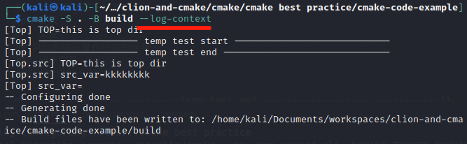

**windows**

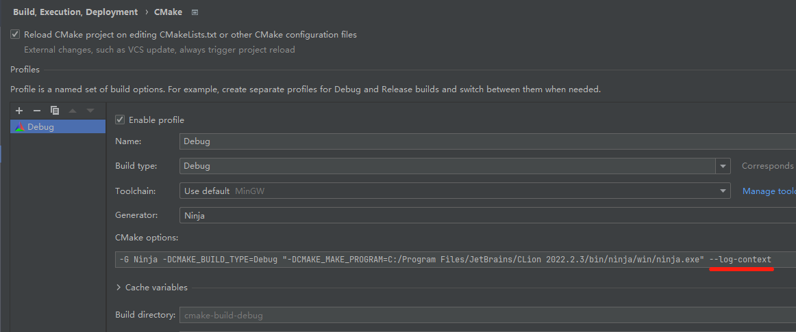

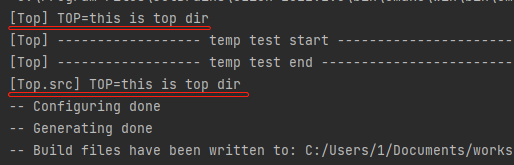

### 引入作用域的几种方式
#### 目录

**例子**

```cmake
cmake_minimum_required(VERSION 3.23 FATAL_ERROR)

project(ch22-scope-of-variable
        VERSION 0.0.1.199
        DESCRIPTION "cmake study project"
        HOMEPAGE_URL "eglinux.com"
        LANGUAGES CXX
        )

list(APPEND CMAKE_MESSAGE_CONTEXT Top)
set(CMAKE_EXPORT_COMPILE_COMMANDS ON)
add_executable(ch22-scope-of-variable src/main.cpp)

set(TOP "this is top dir")
message("TOP=${TOP}")

add_subdirectory(src)
```

```cmake
cmake_minimum_required(VERSION 3.23 FATAL_ERROR)
list(APPEND CMAKE_MESSAGE_CONTEXT src)
message("TOP=${TOP}")
```

#### 函数

```cmake
cmake_minimum_required(VERSION 3.23 FATAL_ERROR)

project(ch22-scope-of-variable
        VERSION 0.0.1.199
        DESCRIPTION "cmake study project"
        HOMEPAGE_URL "eglinux.com"
        LANGUAGES CXX
        )

list(APPEND CMAKE_MESSAGE_CONTEXT Top)
set(CMAKE_EXPORT_COMPILE_COMMANDS ON)
add_executable(ch22-scope-of-variable src/main.cpp)

set(TOP "this is top dir")
message("TOP=${TOP}")

function(test_var)
    set(func_var "this is func var")
    message("test_var func TOP=${TOP}")
    message("test_var func func_var=${func_var}")
endfunction()
test_var()
message("top func func_var=${func_var}")
```


### 其他影响变量作用域的场景
#### 缓存变量

```cmake
# 父级CMakeLists.txt
message("is_top=${is_top}")
add_subdirectory(src)

# 子级CMakeLists.txt
option(is_top OFF "is top dir")
message("is_top=${is_top}")
```

运行两次，第一次父目录打印为空，第二次为OFF

#### PARENT_SCOPE

```cmake
# 父级CMakeLists.txt
add_subdirectory(src)
message("src_var=${src_var}") # this is sub variable

# 子级CMakeLists.txt
set(src_var "this is sub variable" PARENT_SCOPE)
message("src_var=${src_var}") # 为空
```


## ch23 初识 CMake 中 target 的概念

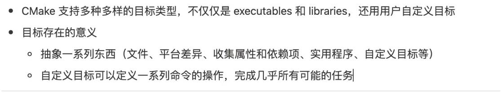

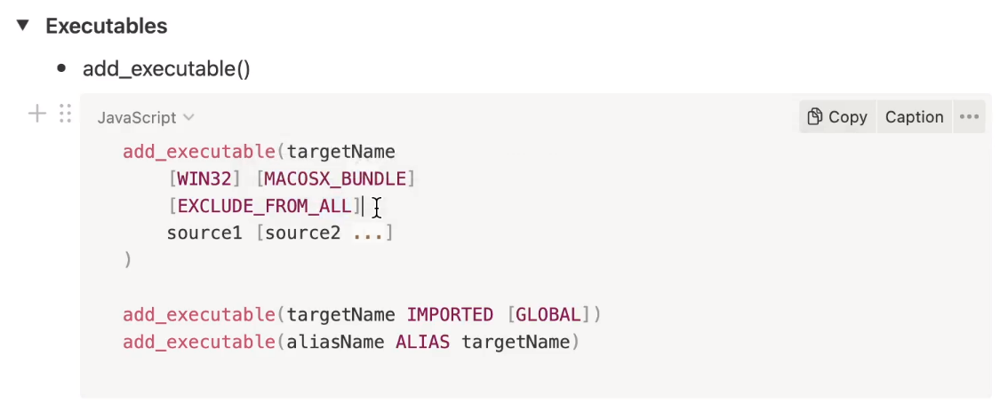

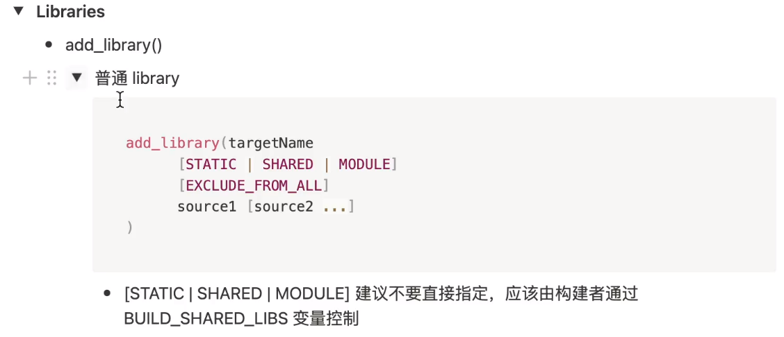

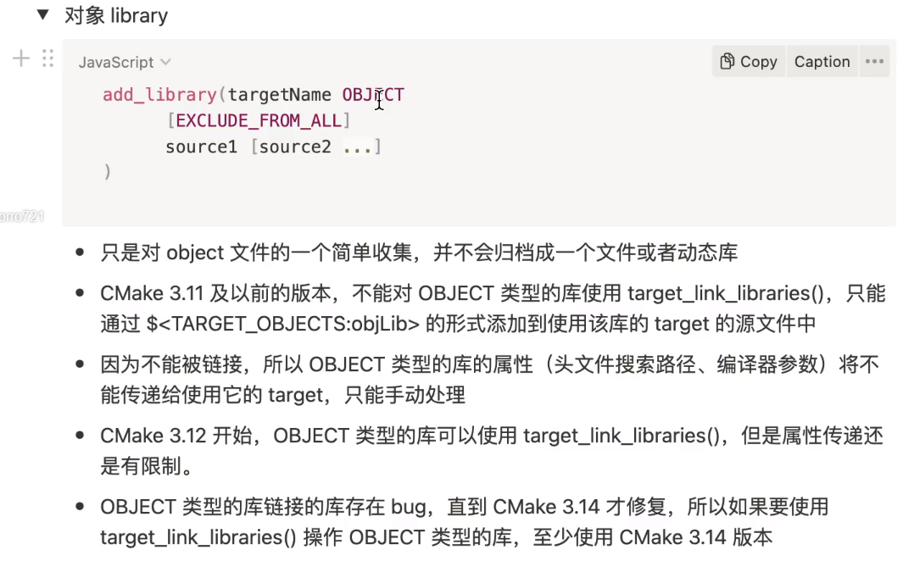

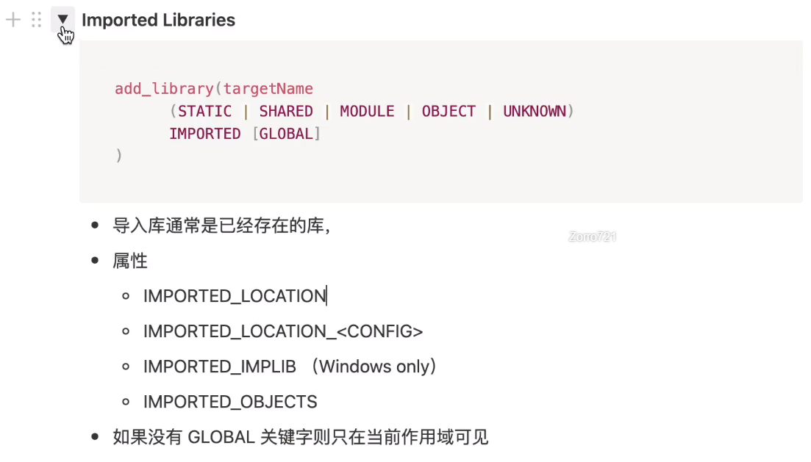

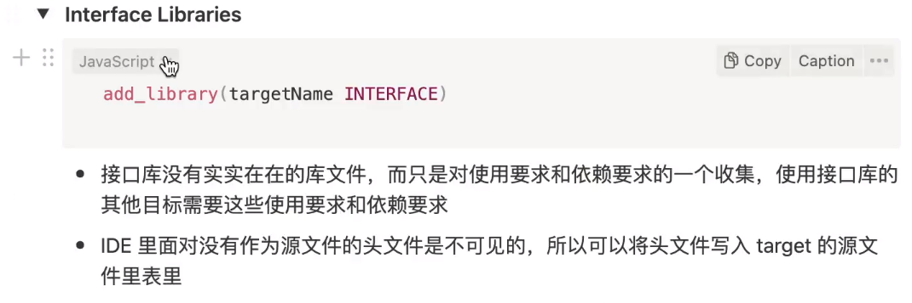

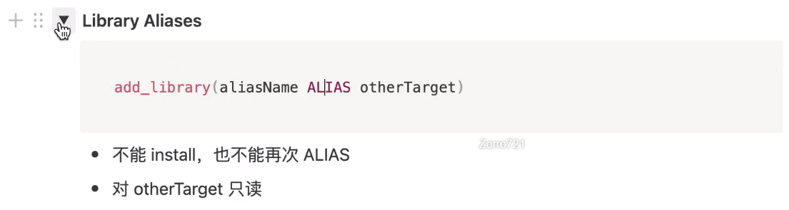

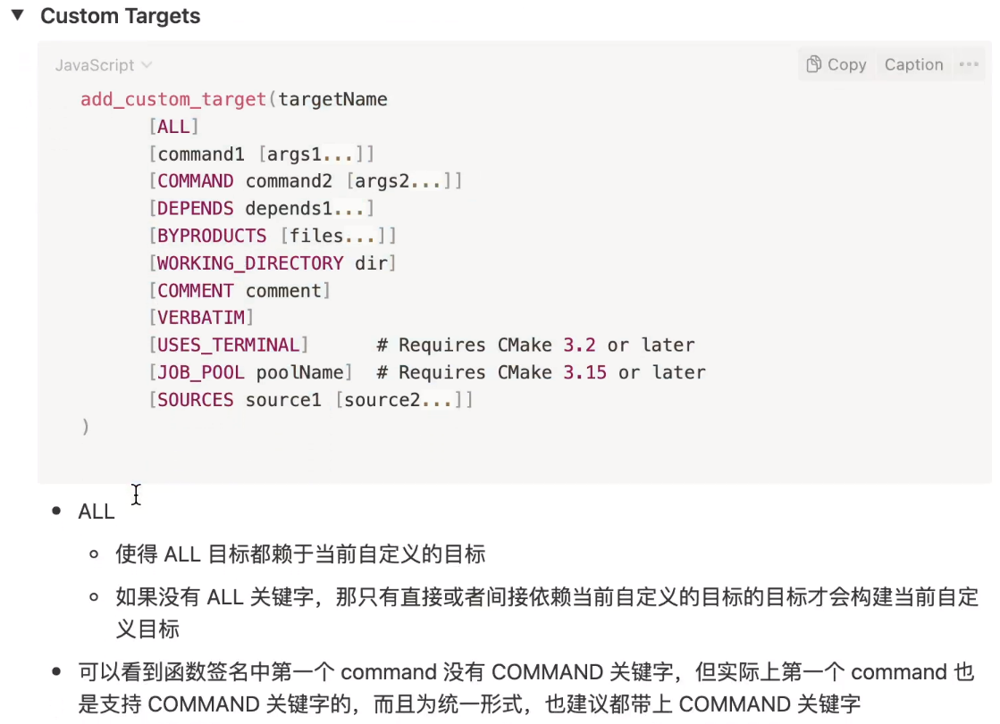

## ch24 初识 CMake 策略

```cmake
cmake_minimum_required(VERSION 3.21 FATAL_ERROR)
project(ch24-policy)

message("------------------ temp test start ----------------------------")
cmake_policy(SET CMP0121 OLD)
list(APPEND MYLIST "abc;def;ghi")
list(GET MYLIST "any" OUT_VAR)
message("OUT_VAR=${OUT_VAR}")

message("------------------ temp test end ------------------------------")
```

```cmake
cmake_minimum_required(VERSION 3.21 FATAL_ERROR)
project(ch24-policy)

message("------------------ temp test start ----------------------------")
list(APPEND MYLIST "abc;def;ghi")
list(GET MYLIST 1 OUT_VAR)
message("OUT_VAR=${OUT_VAR}")

message("------------------ temp test end ------------------------------")
```

```CMAKE
cmake_minimum_required(VERSION 3.21 FATAL_ERROR)
project(ch24-policy)

message("------------------ temp test start ----------------------------")
cmake_policy(PUSH)
cmake_policy(SET CMP0121 OLD)
list(APPEND MYLIST "abc;def;ghi")
list(GET MYLIST "any" OUT_VAR)
message("OUT_VAR=${OUT_VAR}")
cmake_policy(POP)
list(APPEND MYLIST "abc;def;ghi")
list(GET MYLIST 1 OUT_VAR)
message("OUT_VAR=${OUT_VAR}")
message("------------------ temp test end ------------------------------")
```


## ch25 初识 CMake 构建类型

```CMAKE
# The default build type must be set before project()
if(CMAKE_SOURCE_DIR STREQUAL CMAKE_CURRENT_SOURCE_DIR AND NOT CMAKE_BUILD_TYPE AND NOT CMAKE_CONFIGURATION_TYPES)
    set(CMAKE_BUILD_TYPE Release CACHE STRING "Build type" FORCE)
    set_property(CACHE CMAKE_BUILD_TYPE PROPERTY STRINGS "Debug" "Release" "MinSizeRel" "RelWithDebInfo")
endif()
message("CMAKE_BUILD_TYPE = ${CMAKE_BUILD_TYPE}")
```

## ch26 初识 CMake 预设

```json
{
  "version": 4,
  "cmakeMinimumRequired": {
    "major": 3,
    "minor": 23,
    "patch": 0
  },
  "configurePresets": [
    {
      "name": "default",
      "displayName": "Default Config",
      "description": "Default build using Ninja generator",
      "generator": "Ninja",
      "binaryDir": "${sourceDir}/build/default",
      "vendor": {
        "eglinux.com/eglinux/1.0": {
          "autoFormat": true
        }
      }
    }
  ],
  "buildPresets": [
    {
      "name": "default",
      "configuration": "default"
    }
  ],
  "vendor": {
    "eglinux.com/eglinux/1.0": {
      "autoFormat": true
    }
  }
}
```


## ch27 CMake 配置阶段命令行基本用法

```
git@github.com:PacktPublishing/CMake-Best-Practices.git
```


```sh
cmake -S <source dir> -B <build dir> -G <Genrator> -D<VAR:TYPE=value>
# 例子，—D有顺序要求
cmake -DCMAKE_CXX_COMPILER=/usr/bin/g++ -DCMAKE_CXX_FLAGS:STRING="-Wall -Werror" -DCMAKE_BUILD_TYPE=Debug -S . -B build -G "Unix Makefiles" -DOPENSSL_ROOT_DIR=/usr/local/opt/openssl@1.1
# 指定编译类型
cmake -DCMAKE_CXX_COMPILER=/usr/bin/g++ -DCMAKE_CXX_FLAGS:STRING="-Wall" -DCMAKE_CXX_FLAGS_RELEASE:STRING="-Werror" -DCMAKE_BUILD_TYPE=Debug -S . -B build -G "Unix Makefiles" -DOPENSSL_ROOT_DIR=/usr/local/opt/openssl@1.1
```

```shell
# 查看缓存变量
cmake -L ./build # 一般的缓存变量
cmake -LAH ./build # 高级的缓存变量，更详细的缓存变量
```


## ch28 CMake 构建阶段命令行基本用法

```sh
# 单线程编译
cmake --build ./build
# 多线程编译
cmake --build ./build --clean-first --parallel 16
# 指定target编译
cmake --build ./build --clean-first --target ch7_test_discovery_example
# 输出更详细的信息
cmake --build ./build --clean-first --target ch7_test_discovery_example --verbose
# 实际编译器的参数
cmake --build ./build --clean-first --target ch7_test_discovery_example -- --warn-undefined-variables # 相当于 make --warn-undefined-variables
```


## ch29 CMake 安装阶段命令行基本用法

```shell
# 配置cmake
cmake -S . -B ./build 
# 编译
cmake --build ./build --clean-first --parallel 4
# 安装
cmake --install ./build --prefix ./out
```

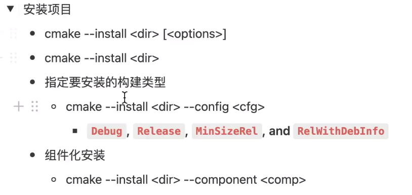

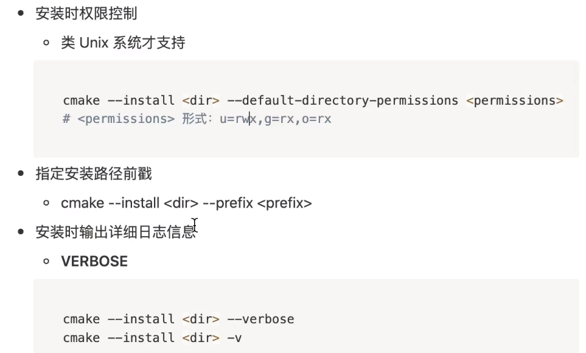


## ch30 如何剥离符号信息

只支持动态库和可执行程序，不支持静态库

```shell
# 剥离符号信息
cmake --install ./build --prefix ./out --strip
```


## ch31 ccmake 使用详解
## ch32 cmake-gui使用详解
## ch33 如何在 Visual Studio 中创建和使用 CMake 项目
## ch34 如何在 vscode 中创建和使用 CMake 项目
## ch35 如何在 Qt Creator 中创建和使用CMake 项目
## ch36 使用CMake 管理一个可执行目标项目
## ch37 使用 CMake 管理一个库目标
## ch38 CMake 如何控制共享库的符号可见性
## ch39 使用CMake 管理仅头文件的库
## ch40 如何在CMake 中使用我们自己的库
## ch41 CMake 管理编译器和连接器的行为
## ch42 CMake 命令之install()
## ch43 如何给其他项目提供我们自己项目的信息
## ch44 CMake 打包详解
## ch45 CMake 查找文件和目录
## ch46 CMake 查找可执行程序
## ch47 CMake 如何查找第三方库
## ch48 如何在自己的项目使用第三方库
## ch49 如何自己写一个CMake 的查找模块
## ch50 vcpkg 使用介绍
## ch51 CMake 如何集成第三方源码
## ch52 CMake 如何在编译阶段执行用户自定义任务
## ch53 如何向已有的目标添加用户自定义任务
## ch54 如何通过用户自定义任务生成文件
## ch55 如何在配置阶段执行用户自定义任务
## ch56 CMake 如何拷贝和更改文件
## ch57 CMake 支持的跨平台命令
## ch58 什么是CMake 脚本
## ch59 CMake 预设详解
## ch60 使用sysroots 隔离构建环境
## ch61 超级构建
## ch62 使用超级构建构建 Qt6
## ch63 如何使用CMake 管理交叉编译
## ch64 CMake集成单元测试框架
## ch65 CMake 集成代码扫描工具
## ch66 CMake 项目优化
## ch67 CMake 代码复用
## ch68 如何迁移非 CMake 项目到 CMake
