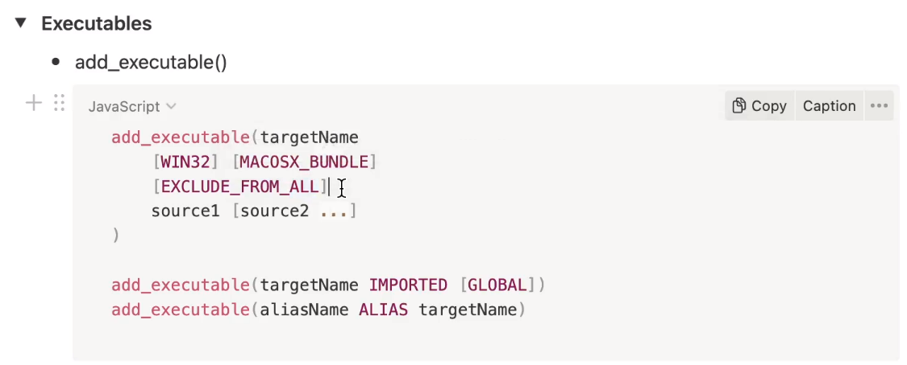
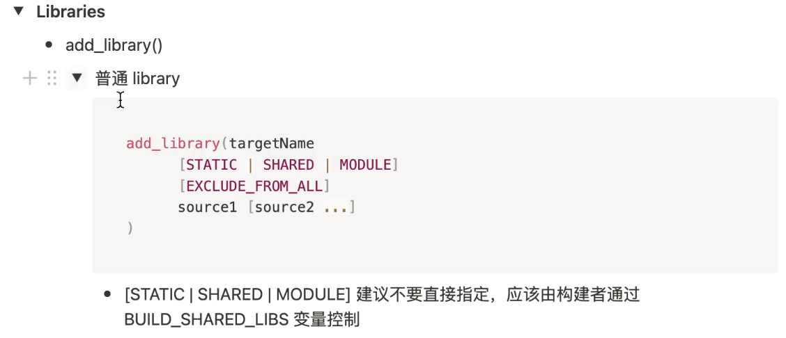
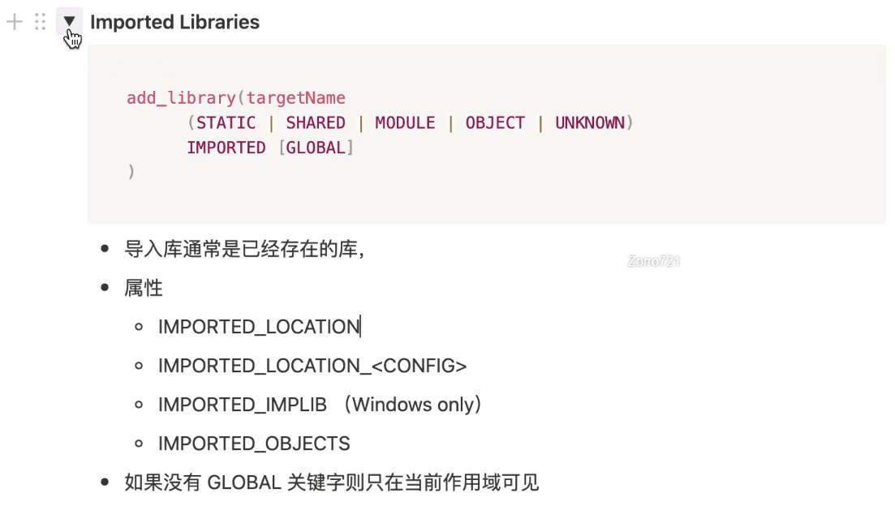
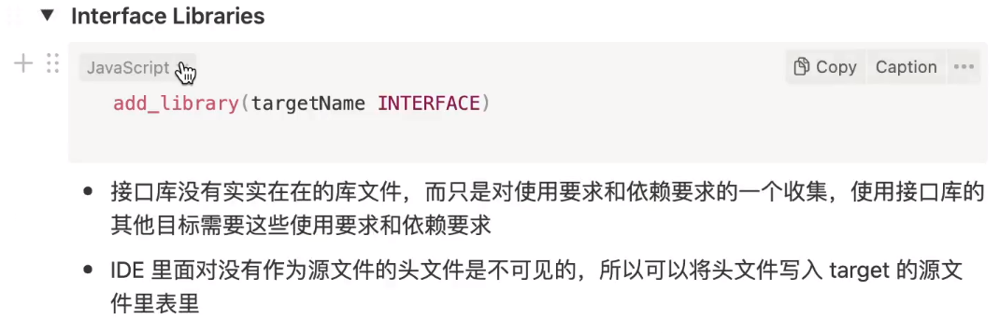
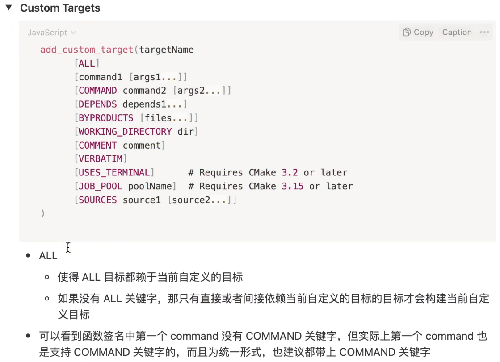
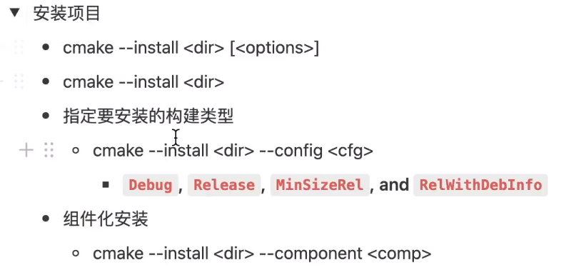
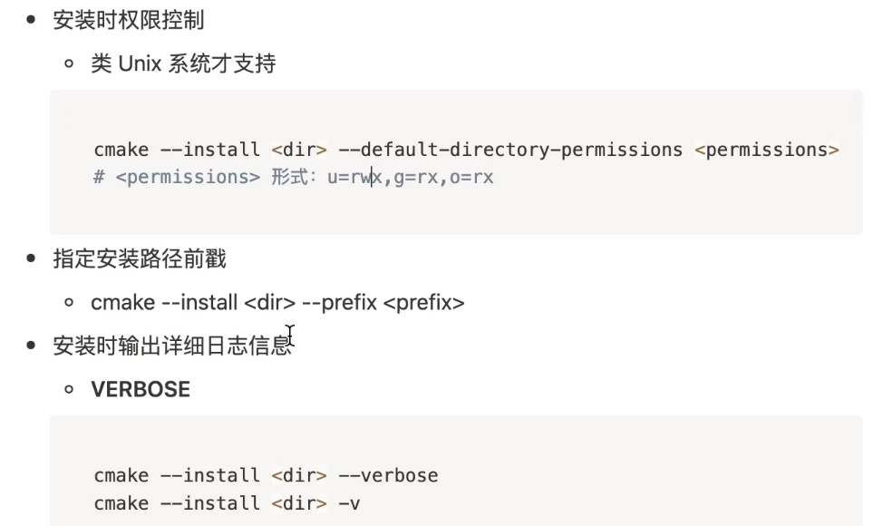
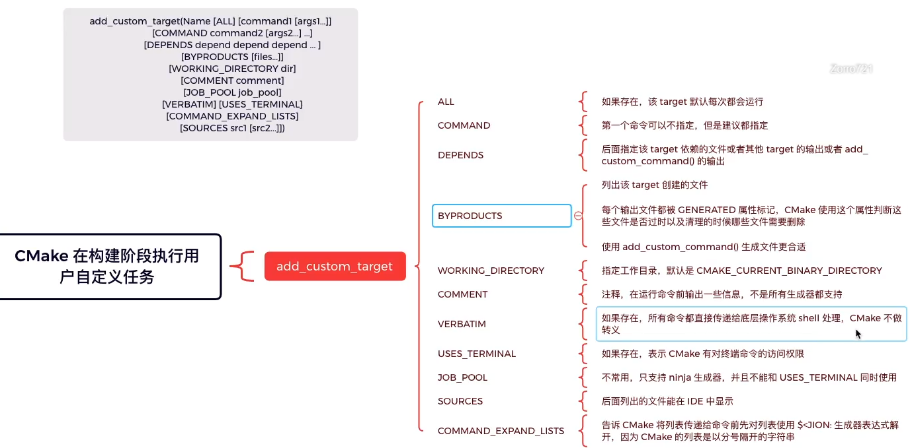
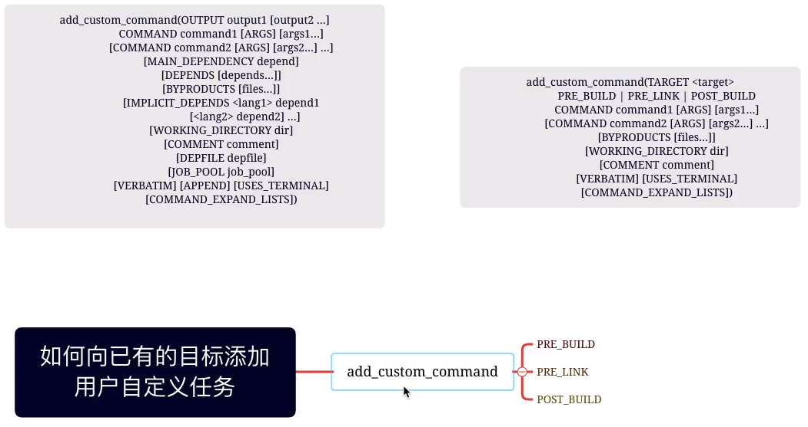

## ch01 CMake 是什么?

#### 例子

**CMakeLists.txt**

```cmake
cmake_minimum_required(VERSION 3.23 FATAL_ERROR)
project(study_cmake
        VERSION 0.0.1
        DESCRIPTION "cmake study project"
        HOMEPAGE_URL "eglinux.com"
        LANGUAGES CXX C
        )

list(APPEND CMAKE_MESSAGE_CONTEXT Top)
set(CMAKE_EXPORT_COMPILE_COMMANDS ON)
message("======================== temp test start ====================================")
add_executable(main src/main.cpp)
message("======================== temp test end ======================================")
```

**src/main.cpp**

```cpp
#include <iostream>
using namespace std;
int main(int argc, const char* argv[]) {
    std::cout << "Hello C++ " << __cplusplus << std::endl;
    return 0;
}
```


## ch02 Linux 安装 CMake

```sh
apt update
apt install cmake -y
```


## ch03 Windows 安装 CMake

## ch04 macOS 安装 CMake

## ch05 CMake 开发环境搭建

## ch06 CMake 命令介绍

## ch07 CMake 交互界面介绍

## ch08 使用 CMake 构建第一个 CMake 项目

**spdlog** 构建日志库项目

```sh
cmake -DSPDLOG_BUILD_TESTS=ON -DCMAKE_BUILD_TYPE=Debug   -S . -B build_debug
cmake --build build_debug
cd build_debug
ctest 
# 打TGZ 和 zip包
cpack
# 打deb包
cpack -G DEB
# 打rpm包
sudo apt install rpm
cpack -G RPM
# 解压deb包
dpkg -X spdlog-1.10.0.deb .
dpkg -e spdlog-1.10.0.deb .
```


## ch09 一个最小的 CMakeLists.txt

```cmake
cmake_minimum_required(VERSION 3.23)
project(study_cmake)
```


## ch10 理解 CMake 的构建过程


## ch11 什么是源码目录和构建目录以及源内构建和源外构建


## ch12 CMake 命令之 project()，和常用命令

### project()

```cmake
# project的变量
PROJECT_NAME # 项目名
CMAKE_PROJECT_NAME # 顶级项目名

# 项目源码的目录
PROJECT_SOURCE_DIR 
ch12_demo_SOURCE_DIR 

# 项目构建的目录
PROJECT_BINARY_DIR 
ch12_demo_BINARY_DIR 

# 是否顶级项目
PROJECT_IS_TOP_LEVEL
ch12_demo_IS_TOP_LEVEL

# 版本号
message("version : ${CMAKE_PROJECT_VERSION}")
message("version : ${CMAKE_PROJECT_VERSION_TWEAK}")
message("version : ${PROJECT_VERSION}")
message("version : ${PROJECT_VERSION_MAJOR}")
message("version : ${PROJECT_VERSION_MINOR}")
message("version : ${PROJECT_VERSION_PATCH}")
message("version : ${PROJECT_VERSION_TWEAK}")

# 项目说明
PROJECT_DESCRIPTION, <PROJECT-NAME>_DESCRIPTION
# 项目主页
PROJECT_HOMEPAGE_URL, <PROJECT-NAME>_HOMEPAGE_URL
```

### 常用命令

#### **AUX_SOURCE_DIRECTORY**

```cmake
aux_source_directory(<dir> <variable>)
```

- 查找当前目录所有源文件 并将源文件名称列表保存到 DIR_DRCS变量中
- 不能查找子目录

#### **file**

**文件操作命令**

```cmake
#将message写入filename文件中，会覆盖文件原有内容
file(WRITE filename "message")
# 将message写入filename文件中，会追加在文件末尾
file(APPEND filename "message")
#从filename文件中读取内容并存储到var变量中，如果指定了numBytes和offset，
#则从offset处开始最多度numBytst个字节，另外如果指定了HEX参数，则内容会以十六进制形式存储在var变量中
file(READ filename var [LIMIT numBytes] [OFFSET offset] [HEX])
#重名名文件
file(RENAME <oldname> <newname>)
#删除文件，等于rm命令
file(REMOVE [file1 ...])
#递归的执行删除文件命令，等于rm -r
file(REMOVE_RECURSE [file1 ...])
#根据指定的url下载文件
#timeout超时时间；下载的状态会保存到status中；下载日志会被保存到log；sum指定所下载文件预期的MD5值，如果指定会自动进行比对
#如果不一致，则返回一个错误；SHOW_PROGRESS,进度信息会以状态信息的形式被打印出来
file(DOWNLOAD url file [TIMEOUT timeout] [STATUS status] [LOG log] [EXPECTED_MD5 sum] [SHOW_PROGRESS])
#创建目录
file(MAKE_DIRECTORY [dir1 dir2 ...])
#会把path转换为以unix的开头的cmake风格路径，保存在result中
file(TO_CMAKE_PATH path result)
#它会把cmake风格的路径转换为本地路径风格：windows下用“\”,而unix下用“/”
file(TO_NATIVE_PATH path result)
#将会为所有匹配查询表达式的文件生成一个list，并将该list存储进变量variable里，如果一个表达式指定了RELATIVE，返回的结果
#将会是相对于给定路径的相对路径，查询表达式例子：*.cxx,*.vt?
#NOTE:按照官方文档的说法，不建议使用file的GLOB指令来收集工程的源文件
file(GLOB variable [RELATIVE path] [globbing expressions]....)
```

#### message

##### 签名

```cmake
message([<mode>] "message text" ...)
```

| mode               | 说明                                                         |
| ------------------ | ------------------------------------------------------------ |
| FATAL_ERROR        | 产生 CMake Error，**会停止编译系统的构建过程**               |
| SEND_ERROR         | CMake错误，继续执行，但是会跳过生成的步骤                    |
| DEPRECATION        | 如果CMAKE_ERROR_DEPRECATED或CMAKE_WARN_DEPRECATED变量分别被启用，则为CMake Deprecation Error或Warning，否则没有消息。 |
| (none) or `NOTICE` | 重要信息打印到stderr以引起用户的注意。                       |
| STATUS             | 项目用户可能感兴趣的主要消息。理想情况下，这些信应该简明扼要，不超过一行，但仍能提供信息。 |
| VERBOSE            | 针对项目用户的详细信息消息。这些消息应该提供在大多数情况下不感兴趣的额外细节，但是对于那些构建项目的人来说，当他们想要更深入地了解正在发生的事情时，这些细节可能会很有用。 |
| DEBUG              | 详细的信息性消息，用于开发人员处理项目本身，而不是只想构建项目的用户。这些消息通常不会引起构建项目的其他用户的兴趣，并且通常与内部实现细节密切相关。 |
| TRACE              | 具有非常低级实现细节的细粒度消息。使用此日志级别的消息通常只是临时的，并且在发布项目、打包文件等之前预期会被删除。 |
| WARNING            | CMake警告，会继续执行                                        |
| AUTHOR_WARNING     | CMake警告（dev），会继续执行                                 |

##### 检测报告

3.17新版功能。

CMake输出中的一个常见模式是指示某种检查开始的消息，然后是报告该检查结果的另一个消息。例如:

```cmake
message(STATUS "Looking for someheader.h")
#... do the checks, set checkSuccess with the result
if(checkSuccess)
  message(STATUS "Looking for someheader.h - found")
else()
  message(STATUS "Looking for someheader.h - not found")
endif()
```

可以用下面代替：

```cmake
message(<checkState> "message" ...)
```

其中< checkState >必须是以下之一:

- CHECK_START：记录一个关于将要执行的检查的简明消息。
- CHECK_PASS：记录一个成功的检查结果。
- CHECK_FAIL：记录一个不成功的检查结果。

在记录检查结果时，该命令会重复最近开始的尚未报告结果的检查的消息，然后是一些分隔符，然后是CHECK_PASS或CHECK_FAIL关键字之后提供的消息文本。检查消息总是报告在STATUS日志级别。

检查可能是嵌套的，并且每个CHECK_START应该恰好有一个匹配的CHECK_PASS或CHECK_FAIL。如果需要的话，CMAKE_MESSAGE_INDENT变量还可以用于向嵌套检查添加缩进。例如:

```cmake
message(CHECK_START "Finding my things")
list(APPEND CMAKE_MESSAGE_INDENT "  ")
unset(missingComponents)

message(CHECK_START "Finding partA")
# ... do check, assume we find A
message(CHECK_PASS "found")

message(CHECK_START "Finding partB")
# ... do check, assume we don't find B
list(APPEND missingComponents B)
message(CHECK_FAIL "not found")

list(POP_BACK CMAKE_MESSAGE_INDENT)
if(missingComponents)
  message(CHECK_FAIL "missing components: ${missingComponents}")
else()
  message(CHECK_PASS "all components found")
endif()
```

上面的输出如下所示:

```
-- Finding my things
--   Finding partA
--   Finding partA - found
--   Finding partB
--   Finding partB - not found
-- Finding my things - missing components: B
```

##### 颜色凸显

我们还可以自定义初始化cmake构建的`message`命令打印颜色，可以方便快速的凸显出错误信息，我们可以创建一个文件`cmake/messagecolor.cmake`：

```cmake
IF (NOT WIN32)
    STRING(ASCII 27 Esc)
    SET(ColourReset "${Esc}[m")
    SET(ColourBold "${Esc}[1m")
    SET(Red "${Esc}[31m")
    SET(Green "${Esc}[32m")
    SET(Yellow "${Esc}[33m")
    SET(Blue "${Esc}[34m")
    SET(MAGENTA "${Esc}[35m")
    SET(Cyan "${Esc}[36m")
    SET(White "${Esc}[37m")
    SET(BoldRed "${Esc}[1;31m")
    SET(BoldGreen "${Esc}[1;32m")
    SET(BoldYellow "${Esc}[1;33m")
    SET(BOLDBLUE "${Esc}[1;34m")
    SET(BOLDMAGENTA "${Esc}[1;35m")
    SET(BoldCyan "${Esc}[1;36m")
    SET(BOLDWHITE "${Esc}[1;37m")
ENDIF ()

FUNCTION(message)
    LIST(GET ARGV 0 MessageType)
    IF (MessageType STREQUAL FATAL_ERROR OR MessageType STREQUAL SEND_ERROR)
        LIST(REMOVE_AT ARGV 0)
        _message(${MessageType} "${BoldRed}${ARGV}${ColourReset}")
    ELSEIF (MessageType STREQUAL WARNING)
        LIST(REMOVE_AT ARGV 0)
        _message(${MessageType}
                "${BoldYellow}${ARGV}${ColourReset}")
    ELSEIF (MessageType STREQUAL AUTHOR_WARNING)
        LIST(REMOVE_AT ARGV 0)
        _message(${MessageType} "${BoldCyan}${ARGV}${ColourReset}")
    ELSEIF (MessageType STREQUAL STATUS)
        LIST(REMOVE_AT ARGV 0)
        _message(${MessageType} "${Green}${ARGV}${ColourReset}")
    ELSEIF (MessageType STREQUAL INFO)
        LIST(REMOVE_AT ARGV 0)
        _message("${Blue}${ARGV}${ColourReset}")
    ELSE ()
        _message("${ARGV}")
    ENDIF ()
ENDFUNCTION()
```

在主CMakeLists.txt中导入该cmake文件，则可以改变message命令各个级别打印的颜色显示。

## ch13 CMake 变量之普通变量，预定义变量

### **布尔常量**

| 类型  | 值                                                           |
| ----- | ------------------------------------------------------------ |
| true  | 1，ON，YES，TRUE，Y，非0的值                                 |
| false | 0，OFF，NO，FALSE,N,IGNORE,NOTFOUND, 空字符串，以-NOTFOUND结尾的字符串 |

### 预定义变量

```cmake
PROJECT_SOURCE_DIR：工程的根目录
PROJECT_BINARY_DIR：运行 cmake 命令的目录，通常是 ${PROJECT_SOURCE_DIR}/build
PROJECT_NAME：返回通过 project 命令定义的项目名称
CMAKE_CURRENT_SOURCE_DIR：当前处理的 CMakeLists.txt 所在的路径
CMAKE_CURRENT_BINARY_DIR：target 编译目录
CMAKE_CURRENT_LIST_DIR：CMakeLists.txt 的完整路径
CMAKE_CURRENT_LIST_LINE：当前所在的行
CMAKE_MODULE_PATH：定义自己的 cmake 模块所在的路径，SET(CMAKE_MODULE_PATH ${PROJECT_SOURCE_DIR}/cmake)，然后可以用INCLUDE命令来调用自己的模块
EXECUTABLE_OUTPUT_PATH：重新定义目标二进制可执行文件的存放位置
LIBRARY_OUTPUT_PATH：重新定义目标链接库文件的存放位置
```

### 环境变量

**使用环境变量**

```cmake
$ENV{Name}
```

**写入环境变量**

```cmake
set(ENV{Name} value) # 这里没有“$”符号
```

**系统信息**

```cmake
CMAKE_MAJOR_VERSION：# cmake 主版本号，比如 3.4.1 中的 3
CMAKE_MINOR_VERSION：# cmake 次版本号，比如 3.4.1 中的 4
CMAKE_PATCH_VERSION：# cmake 补丁等级，比如 3.4.1 中的 1
CMAKE_SYSTEM：# 系统名称，比如 Linux-­2.6.22
CMAKE_SYSTEM_NAME：# 不包含版本的系统名，比如 Linux
CMAKE_SYSTEM_VERSION：# 系统版本，比如 2.6.22
CMAKE_SYSTEM_PROCESSOR：# 处理器名称，比如 i686
UNIX：# 在所有的类 UNIX 平台下该值为 TRUE，包括 OS X 和 cygwin
WIN32：# 在所有的 win32 平台下该值为 TRUE，包括 cygwin
```


### 常见的变量定义

```cmake
# 可以多个值，分隔符默认空格和分号
set(myVar a b c d)
list(LENGTH myVar outVar)
message("myVar=${myVar}  myVar length=${outVar}")
```

```cmake
#### 常见的变量定义 ###############
message("####################")
set(foo ab)                 # ab
message("foo=${foo}")
set(bar ${foo}cd)           # abcd
message("bar=${bar}")
set(baz ${foo} cd)          # ab;cd
message("baz=${baz}")
set(myVar ba)               # ba
message("myVar=${myVar}")
set(big "${${myVar}r}ef")   # abcdef
message("big=${big}")
set(${foo} xyz)             # set(ab xyz), ab=xyz
message("${foo}=${${foo}}")
# 打印not_define
set(bar ${not_define})
message("bar=${bar}")
```

### **多行打印**

```cmake
set(myVar "goes here")
set(multline "First line ${myVar}
Second line with a \"quoted\" word")
message("${multline}")

#####################################
set(myVar "goes here")
# 原生字符串：[=[asdf]=]，零到无数个等号
set(multline [==[First line ${myVar}
Second line with a "quoted" word"]==])
message("${multline}")
```

**取消变量**

```cmake
unset(multline)
```

## ch14 CMake 命令之 lists()

https://blog.csdn.net/fengbingchun/article/details/127715230

#### 读取列表

```cmake
set(my_list a b c d e)

# 读取列表长度
list(LENGTH my_list len)
message("len=${len}")

# 读取元素
list(GET my_list 0 1 elem)
message("elem=${elem}")

# 粘连列表
list(JOIN my_list - out_var)
message("out_var=${out_var}")

# 子列表
list(SUBLIST my_list 1 3 out_var)
message("out_var=${out_var}")
```


#### 搜索列表

```cmake
set(my_list a b c d e)
list(FIND my_list d out_var) # 找不到返回-1，找到返回下标
message("out_var=${out_var}")
```


#### 修改列表

```cmake
# 追加元素
set(my_list a b c d e)
# list(APPEND <list> [<element> ...])
list(APPEND my_list 1 2;3 4)
message("my_list=${my_list}")

# 正则表达式
set(my_list a b c d e)
# list(FILTER <list> <INCLUDE|EXCLUDE> REGEX <regular_expression>)
list(FILTER my_list INCLUDE REGEX [0-9])
message("my_list=${my_list}")

# 插入元素
set(my_list a b c d e)
# list(INSERT <list> <element_index> <element> [<element> ...])
list(INSERT my_list 0 @ * & )
message("my_list=${my_list}")

# 弹出元素
set(my_list a b c d e)
# list(POP_BACK <list> [<out-var>...])
list(POP_BACK my_list ele1 ele2)
message("${ele1} ${ele2}")
# list(POP_FRONT <list> [<out-var>...])
list(POP_FRONT my_list ele1 ele2)
message("${ele1} ${ele2}")

# 头部追加
set(my_list a b c d e)
# list(PREPEND <list> [<element> ...])
list(PREPEND my_list ele1 ele2)
message("${my_list}")

# 移除元素
set(my_list a b c d e)
# list(REMOVE_ITEM <list> <value> [<value> ...])
list(REMOVE_ITEM my_list a b)
message("${my_list}")
# list(REMOVE_AT <list> <index> [<index> ...])
list(REMOVE_AT my_list 0 1)
message("${my_list}")
# list(REMOVE_DUPLICATES <list>)
# 删除重复元素
set(mylist a a b b c c d d)
list(REMOVE_DUPLICATES mylist)
message("${mylist}")

# 转换
#list(TRANSFORM <list> <ACTION> [<SELECTOR>] [OUTPUT_VARIABLE <output variable>])
#list(TRANSFORM <list> <APPEND|PREPEND> <value> ...) # 将指定的value追加或前置到list的每个元素
#list(TRANSFORM <list> <TOLOWER|TOUPPER> ...) # 将list的每个元素转换为大写或小写字符
#list(TRANSFORM <list> STRIP ...) # 移除list中的前后空格
#list(TRANSFORM <list> GENEX_STRIP ...) # 从list的每个元素中删除any generator expressions
#list(TRANSFORM <list> REPLACE <regular_expression> <replace_expression> ...) # 匹配正则表达式,替换list中每个元素的匹配项

#list(TRANSFORM <list> <ACTION> [<SELECTOR>] [OUTPUT_VARIABLE <output variable>])
set(MY_LIST 1 2 3 4 5 6 7 8 9)
list(TRANSFORM MY_LIST PREPEND  he-)
list(TRANSFORM MY_LIST APPEND  0)
message("${MY_LIST}")

list(TRANSFORM my_list APPEND "x" FOR 2 5 1 OUTPUT_VARIABLE A_out)
message("${A_out}")
message("${my_list}")

set(values a b c d e)
list(TRANSFORM values APPEND 1)
message("values: ${values}") # values: a1;b1;c1;d1;e1
list(TRANSFORM values PREPEND 2)
message("values: ${values}") # values: 2a1;2b1;2c1;2d1;2e1
 
set(values a b c d e)
list(TRANSFORM values APPEND 1 OUTPUT_VARIABLE var)
message("values: ${values}; var: ${var}") # values: a;b;c;d;e; var: a1;b1;c1;d1;e1

set(values a b c d e)
list(TRANSFORM values APPEND 1 AT 0 3)
message("values: ${values}") # values: a1;b;c;d1;e
 
set(values a b c d e 1 2 3 4 5)
list(TRANSFORM values APPEND "#" FOR 2 8 2)
message("values: ${values}") # values: a;b;c#;d;e#;1;2#;3;4#;5
 
set(values a b c d e 1 2 3 4 5)
list(TRANSFORM values APPEND "#" REGEX [a-c])
message("values: ${values}") # values: a#;b#;c#;d;e;1;2;3;4;5
 
set(my_list a Bb c dD e Ff)
list(TRANSFORM my_list TOLOWER )
message("${my_list}")

set(values a b c d e)
list(TRANSFORM values TOUPPER)
message("values: ${values}") # values: A;B;C;D;E
list(TRANSFORM values TOLOWER)
message("values: ${values}") # values: a;b;c;d;e
 
set(values a b c d e)
list(APPEND values " f j " " p  q ")
message("values: ${values}") # values: a;b;c;d;e; f j ; p  q 
list(TRANSFORM values STRIP)
message("values: ${values}") # values: a;b;c;d;e;f j;p  q
 
set(value one;$<1:two;three>;four;$<TARGET_OBJECTS:some_target>)
list(TRANSFORM value GENEX_STRIP)
message("value: ${value}") # value: one;$<1:two;three>;four;
 
set(values a 1 b 2 c 3 d 4 e 5)
list(TRANSFORM values REPLACE "[a-z]" "T")
message("values: ${values}") # values: T;1;T;2;T;3;T;4;T;5
```


#### 排序列表

```CMAKE
list(REVERSE <list>)
```

逆序本列表

```cmake
list(SORT <list> [COMPARE <compare>] [CASE <case>] [ORDER <order>])
```

排序列表。

**`COMPARE` 选择排序方法，`<compare>` 选择以下之一:**

- `STRING`: 默认，按字母顺序对字符串进行排序。

- `FILE_BASENAME`: 按文件路径的基本名称进行排序。

- `NATURAL`: 按数值大小进行排序。

**`CASE` 选择排序时是否区分大小写。`<case>` 选择以下之一:**

- `SENSITIVE`: 默认，对大小写敏感，区分大小写

- `INSENSITIVE`: 对大小写不敏感，不区分大小写

**`ORDER` 用于控制排序。`<orde>` 选择以下之一:**

- `ASCENDING`: 默认，升序排序。

- `DESCENDING`: 降序排序。


## ch15 CMake变量之缓存变量

```cmake
# 第一种定义方式
set(<variable> <value>... CACHE <type> <docstring> [FORCE])
# 第二种定义方式
option(<variable> "<help_text>" [value])
```

支持的类型：

- `BOOL`

  Boolean `ON/OFF` value.

- `FILEPATH`

  Path to a file on disk.

- `PATH`

  Path to a directory on disk.

- `STRING`

  A line of text.

- `INTERNAL`(很少使用，忽略)

  A line of text.


**例子**

```cmake
# set(<variable> <value>... CACHE <type> <docstring> [FORCE])
# 布尔变量
set(PRINT_HELLO ON CACHE BOOL "is print hello" FORCE)
if (PRINT_HELLO)
    message("PRINT_HELLO:${PRINT_HELLO}")
endif ()

set(AA /USR /OPT CACHE PATH "is print hello" FORCE)
message("${AA}")
```


## ch16 C Make中属性的概念

这节只对属性有感性的认识

```cmake
set_property(GLOBAL PROPERTY study_cmake_path "/home/eglinux/")
get_property(out_var GLOBAL PROPERTY study_cmake_path)
message("${out_var}")
```

## ch17 CMake 流程控制之判断条件和if()命令

| 类型 | 值                                                           |
| ---- | ------------------------------------------------------------ |
| 一元 | EXISTS, COMMAND, DEFINED                                     |
| 二元 | EQUAL, LESS, LESS_EQUAL, GREATER, GREATER_EQUAL,<br/>STREQUAL, STRLESS, STRLESS_EQUAL, STRGREATER,<br/>STRGREATER_EQUAL, VERSION_EQUAL, VERSION_LESS,<br/>VERSION_LESS_EQUAL, VERSION_GREATER, VERSION_GREATER_EQUAL, MATCHES |
| 逻辑 | NOT, AND, OR                                                 |

```CMAKE
set(var ON)
if (var)
    message("真")
else()
    message("假")
endif ()

# 判断命令、函数和宏是否存在
if (COMMAND cmake_minimum_required)
    message("真")
else()
    message("假")
endif ()

# 判断目标是否存在
if (TARGET ch17_if_judge)
    message("真")
else()
    message("假")
endif ()

# 判断测试是否存在
add_test(test1 1)
if (TEST test1)
    message("真")
else()
    message("假")
endif ()

# 判断变量是否存在
set(var ON)
if (DEFINED var)
    message("真")
else()
    message("假")
endif ()

#######################################
# 文件操作
# 判断文件或者文件夹存在否
if (EXISTS [[C:\Users\1\Documents\workspaces\clion-and-cmake\cmake\cmake best practice\cmake-code-example]])
    message("真")
else()
    message("假")
endif ()

# 判断两个文件，哪个更新
if ("${PROJECT_SOURCE_DIR}/CMakeLists.txt" IS_NEWER_THAN "${PROJECT_SOURCE_DIR}/main.cpp")
    message("真")
else()
    message("假")
endif ()

if ("${PROJECT_SOURCE_DIR}/main.cpp" IS_NEWER_THAN "${PROJECT_SOURCE_DIR}/CMakeLists.txt")
    message("真")
else()
    message("假")
endif ()

# 是否是一个文件夹
if (IS_DIRECTORY ${PROJECT_SOURCE_DIR}/CMakeLists.txt)
    message("真")
else()
    message("假")
endif ()

# 是否是一个符号链接
if (IS_SYMLINK ${PROJECT_SOURCE_DIR}/CMakeLists.txt)
    message("真")
else()
    message("假")
endif ()

# 是否是一个符号链接
if (IS_ABSOLUTE ${PROJECT_SOURCE_DIR}/CMakeLists.txt)
    message("真")
else()
    message("假")
endif ()

# 是否是一个符号链接
if ("123" MATCHES "[0-9]")
    message("真")
else()
    message("假")
endif ()

# 比较
if(<variable|string> LESS <variable|string>)
if(<variable|string> GREATER <variable|string>)
if(<variable|string> EQUAL <variable|string>)
if(<variable|string> LESS_EQUAL <variable|string>)
if(<variable|string> GREATER_EQUAL <variable|string>)
if(<variable|string> STRLESS <variable|string>)
if(<variable|string> STRGREATER <variable|string>)
if(<variable|string> STREQUAL <variable|string>)
if(<variable|string> STRLESS_EQUAL <variable|string>)
if(<variable|string> STRGREATER_EQUAL <variable|string>)

# 比较版本号
if(<variable|string> VERSION_LESS <variable|string>)
if(<variable|string> VERSION_GREATER <variable|string>)
if(<variable|string> VERSION_EQUAL <variable|string>)
if(<variable|string> VERSION_LESS_EQUAL <variable|string>)
if(<variable|string> VERSION_GREATER_EQUAL <variable|string>)
```

## ch18 CMake 流程控制之while()命令

```cmake
set(MYVAR 0)
while (MYVAR LESS 5)
    math(EXPR MYVAR "${MYVAR}+1")
    if (MYVAR EQUAL 3)
        continue()
    endif ()
    message(STATUS "MYVAR is '${MYVAR}'")
endwhile ()

set(MYVAR 0)
while (MYVAR LESS 5)
    math(EXPR MYVAR "${MYVAR}+1")
    if (MYVAR EQUAL 3)
        break()
    endif ()
    message(STATUS "MYVAR is '${MYVAR}'")
endwhile ()
```


## ch19 CMake 流程控制之 foreach() 命令

```cmake
foreach (item 2 4 5)
    message("item=${item}")
endforeach ()

foreach (var RANGE 10)
    message("var=${var}")
endforeach ()

foreach (var RANGE 0 100 10)
    message("var=${var}")
endforeach ()

set(mylist a b c d)
foreach (var IN LISTS mylist)
    message("var=${var}")
endforeach ()


set(A 0;1)
set(B 2 3)
set(C "4 5")
set(D 6;7 8)
set(E "")
foreach(X IN LISTS A B C D E)
    message(STATUS "X=${X}")
endforeach()

########################################
list(APPEND English one two three four)
list(APPEND Bahasa satu dua tiga)

foreach(num IN ZIP_LISTS English Bahasa)
    message(STATUS "num_0=${num_0}, num_1=${num_1}")
endforeach()

foreach(en ba IN ZIP_LISTS English Bahasa)
    message(STATUS "en=${en}, ba=${ba}")
endforeach()
```

## ch20 CMake 如何定义函数

```cmake
function(my_fun sss tttt)
    message("sss=${sss}")
    message("tttt=${tttt}")
endfunction()
my_fun("asdf" "123")
```


## ch21 CMake 如何定义宏以及宏与函数的区别

```cmake
# 函数与宏的主要差别就是函数引入新的作用域，宏没有引入新的作用域
function(my_fun sss tttt)
    set(fun_var "jjjjjjjjjjj")
    message("sss=${sss}")
    message("tttt=${tttt}")
    return()
    message("fun_var=${fun_var}")
endfunction()
my_fun("123" "456")
message("fun_var=${fun_var}")

message("+++++++++++++++++++++++++++++++++")

macro(my_macro arg1 arg2)
    set(macro_var "kkkkkkkkkkk")
    message("arg1=${arg1}")
    message("arg2=${arg2}")
    return()
    message("macro_var=${macro_var}")
endmacro()
my_macro("aaaaa" "bbbbb")
message("macro_var=${macro_var}")
```


## ch22 CMake 变量的作用域

同一个项目，不同目录，启用message()命令输出附加到每个消息的上下文：

**设置：**

编译cmake加上：`--log-context`

在CMakeLists.txt上加上：`list(APPEND CMAKE_MESSAGE_CONTEXT Top)`

**效果**

**Linux**


**windows**


### 引入作用域的几种方式

#### 目录

**例子**

```cmake
cmake_minimum_required(VERSION 3.23 FATAL_ERROR)

project(ch22-scope-of-variable
        VERSION 0.0.1.199
        DESCRIPTION "cmake study project"
        HOMEPAGE_URL "eglinux.com"
        LANGUAGES CXX
        )

list(APPEND CMAKE_MESSAGE_CONTEXT Top)
set(CMAKE_EXPORT_COMPILE_COMMANDS ON)
add_executable(ch22-scope-of-variable src/main.cpp)

set(TOP "this is top dir")
message("TOP=${TOP}")

add_subdirectory(src)
```

```cmake
cmake_minimum_required(VERSION 3.23 FATAL_ERROR)
list(APPEND CMAKE_MESSAGE_CONTEXT src)
message("TOP=${TOP}")
```

#### 函数

```cmake
cmake_minimum_required(VERSION 3.23 FATAL_ERROR)

project(ch22-scope-of-variable
        VERSION 0.0.1.199
        DESCRIPTION "cmake study project"
        HOMEPAGE_URL "eglinux.com"
        LANGUAGES CXX
        )

list(APPEND CMAKE_MESSAGE_CONTEXT Top)
set(CMAKE_EXPORT_COMPILE_COMMANDS ON)
add_executable(ch22-scope-of-variable src/main.cpp)

set(TOP "this is top dir")
message("TOP=${TOP}")

function(test_var)
    set(func_var "this is func var")
    message("test_var func TOP=${TOP}")
    message("test_var func func_var=${func_var}")
endfunction()
test_var()
message("top func func_var=${func_var}")
```


### 其他影响变量作用域的场景

#### 缓存变量

```cmake
# 父级CMakeLists.txt
message("is_top=${is_top}")
add_subdirectory(src)

# 子级CMakeLists.txt
option(is_top OFF "is top dir")
message("is_top=${is_top}")
```

运行两次，第一次父目录打印为空，第二次为OFF

#### PARENT_SCOPE

```cmake
# 父级CMakeLists.txt
add_subdirectory(src)
message("src_var=${src_var}") # this is sub variable

# 子级CMakeLists.txt
set(src_var "this is sub variable" PARENT_SCOPE)
message("src_var=${src_var}") # 为空
```


## ch23 初识 CMake 中 target 的概念














## ch24 初识 CMake 策略

```cmake
cmake_minimum_required(VERSION 3.21 FATAL_ERROR)
project(ch24-policy)

message("------------------ temp test start ----------------------------")
cmake_policy(SET CMP0121 OLD)
list(APPEND MYLIST "abc;def;ghi")
list(GET MYLIST "any" OUT_VAR)
message("OUT_VAR=${OUT_VAR}")

message("------------------ temp test end ------------------------------")
```

```cmake
cmake_minimum_required(VERSION 3.21 FATAL_ERROR)
project(ch24-policy)

message("------------------ temp test start ----------------------------")
list(APPEND MYLIST "abc;def;ghi")
list(GET MYLIST 1 OUT_VAR)
message("OUT_VAR=${OUT_VAR}")

message("------------------ temp test end ------------------------------")
```

```CMAKE
cmake_minimum_required(VERSION 3.21 FATAL_ERROR)
project(ch24-policy)

message("------------------ temp test start ----------------------------")
cmake_policy(PUSH)
cmake_policy(SET CMP0121 OLD)
list(APPEND MYLIST "abc;def;ghi")
list(GET MYLIST "any" OUT_VAR)
message("OUT_VAR=${OUT_VAR}")
cmake_policy(POP)
list(APPEND MYLIST "abc;def;ghi")
list(GET MYLIST 1 OUT_VAR)
message("OUT_VAR=${OUT_VAR}")
message("------------------ temp test end ------------------------------")
```


## ch25 初识 CMake 构建类型

```CMAKE
# The default build type must be set before project()
if(CMAKE_SOURCE_DIR STREQUAL CMAKE_CURRENT_SOURCE_DIR AND NOT CMAKE_BUILD_TYPE AND NOT CMAKE_CONFIGURATION_TYPES)
    set(CMAKE_BUILD_TYPE Release CACHE STRING "Build type" FORCE)
    set_property(CACHE CMAKE_BUILD_TYPE PROPERTY STRINGS "Debug" "Release" "MinSizeRel" "RelWithDebInfo")
endif()
message("CMAKE_BUILD_TYPE = ${CMAKE_BUILD_TYPE}")
```

## ch26 初识 CMake 预设

```json
{
  "version": 4,
  "cmakeMinimumRequired": {
    "major": 3,
    "minor": 23,
    "patch": 0
  },
  "configurePresets": [
    {
      "name": "default",
      "displayName": "Default Config",
      "description": "Default build using Ninja generator",
      "generator": "Ninja",
      "binaryDir": "${sourceDir}/build/default",
      "vendor": {
        "eglinux.com/eglinux/1.0": {
          "autoFormat": true
        }
      }
    }
  ],
  "buildPresets": [
    {
      "name": "default",
      "configuration": "default"
    }
  ],
  "vendor": {
    "eglinux.com/eglinux/1.0": {
      "autoFormat": true
    }
  }
}
```


## ch27 CMake 配置阶段命令行基本用法

```
git@github.com:PacktPublishing/CMake-Best-Practices.git
```


```sh
cmake -S <source dir> -B <build dir> -G <Genrator> -D<VAR:TYPE=value>
# 例子，—D有顺序要求
cmake -DCMAKE_CXX_COMPILER=/usr/bin/g++ -DCMAKE_CXX_FLAGS:STRING="-Wall -Werror" -DCMAKE_BUILD_TYPE=Debug -S . -B build -G "Unix Makefiles" -DOPENSSL_ROOT_DIR=/usr/local/opt/openssl@1.1
# 指定编译类型
cmake -DCMAKE_CXX_COMPILER=/usr/bin/g++ -DCMAKE_CXX_FLAGS:STRING="-Wall" -DCMAKE_CXX_FLAGS_RELEASE:STRING="-Werror" -DCMAKE_BUILD_TYPE=Debug -S . -B build -G "Unix Makefiles" -DOPENSSL_ROOT_DIR=/usr/local/opt/openssl@1.1
```

```shell
# 查看缓存变量
cmake -L ./build # 一般的缓存变量
cmake -LAH ./build # 高级的缓存变量，更详细的缓存变量
```

### Debug与Release构建

为了方便debug，我们在开发过程中一般是编译Debug版本的库或者应用，可以利用gdb调试很轻松的就可以发现错误具体所在。在主cmake文件中我们只需要加如下设置即可：

```cmake
IF(NOT CMAKE_BUILD_TYPE)
    SET(CMAKE_BUILD_TYPE "Debug" CACHE STRING "Choose Release or Debug" FORCE)
ENDIF()
MESSAGE(STATUS "Build type: " ${CMAKE_BUILD_TYPE})
```

在执行cmake命令的时候可以设置`CMAKE_BUILD_TYPE`变量值切换`Debug`或者`Release`版本编译：

```sh
$ cmake .. -DCMAKE_BUILD_TYPE=Release
```


## ch28 CMake 构建阶段命令行基本用法

```sh
# 单线程编译
cmake --build ./build
# 多线程编译
cmake --build ./build --clean-first --parallel 16
# 指定target编译
cmake --build ./build --clean-first --target ch7_test_discovery_example
# 输出更详细的信息
cmake --build ./build --clean-first --target ch7_test_discovery_example --verbose
# 实际编译器的参数
cmake --build ./build --clean-first --target ch7_test_discovery_example -- --warn-undefined-variables # 相当于 make --warn-undefined-variables
```


## ch29 CMake 安装阶段命令行基本用法

```shell
# 配置cmake
cmake -S . -B ./build 
# 编译
cmake --build ./build --clean-first --parallel 4
# 安装
cmake --install ./build --prefix ./out
```






## ch30 如何剥离符号信息

只支持动态库和可执行程序，不支持静态库

```shell
# 剥离符号信息
cmake --install ./build --prefix ./out --strip
```


## ch31 ccmake 使用详解

## ch32 cmake-gui使用详解

## ch33 如何在 Visual Studio 中创建和使用 CMake 项目

## ch34 如何在 vscode 中创建和使用 CMake 项目

```cmake
cmake_minimum_required(VERSION 3.23 FATAL_ERROR)
project(ch34-vscode-project
        VERSION 0.0.1
        DESCRIPTION "This is my first cmake repo"
        HOMEPAGE_URL "EGLINUX.COM"
        LANGUAGES CXX
        )

set(CMAKE_CXX_STANDARD 17)
set(CMAKE_CXX_STANDARD_REQUIRED ON)
set(CMAKE_CXX_EXTENSIONS OFF)

list(APPEND CMAKE_MESSAGE_CONTEXT Top)
add_executable(ch34-vscode-project)
target_sources(ch34-vscode-project PRIVATE main.cpp)
```


## ch35 如何在 Qt Creator 中创建和使用CMake 项目

## ch36 使用CMake 管理一个可执行目标项目

```http
git@github.com:eglinuxer/mcmake.git
```


## ch37 使用 CMake 管理一个库目标

```cmake
# 默认是静态库
add_library(<name> [STATIC | SHARED | MODULE]
            [EXCLUDE_FROM_ALL]
            [<source>...])
```

```sh
# 也可以配置的时候，指定
cmake -DBUILD_SHARED_LIBS=ON -S . -B ./build --log-context
```

```cmake
# 给动态库加版本号
set_target_properties(hello
        PROPERTIES VERSION ${PROJECT_VERSION}
        SOVERSION ${PROJECT_VERSION_MAJOR}
        )
```


## ch38 CMake 如何控制共享库的符号可见性

## ch39 使用CMake 管理仅头文件的库

## ch40 如何在CMake 中使用我们自己的库

## ch41 CMake 管理编译器和连接器的行为

target_compile_definitions

```cmake
cmake_minimum_required(VERSION 3.23 FATAL_ERROR)

project(ch41_manage_compiler_linker
    VERSION 0.0.1
    DESCRIPTION "A collection of sample C++ applications and libraries to demonstrate creating libraries and executables"
    LANGUAGES CXX
)

add_executable(main)
target_sources(main PRIVATE src/main.cpp)

target_compile_definitions(main PRIVATE GIT_VERSION="${CMAKE_PROJECT_VERSION}")
```

```cpp
//
// Created by zzj on 2022/10/16.
//
#include <iostream>

#ifndef GIT_VERSION
#define GIT_VERSION unknown
#endif

using namespace std;

const char git_rev[] = GIT_VERSION;

int main(int argc, const char *argv[]) {
    std::cout << "Hello C++ " << __cplusplus << std::endl;
    cout << "git version: " << git_rev << endl;
    return 0;
}
```

## ch42 CMake 命令之install()

### 1安装可执行文件

```cmake
cmake_minimum_required(VERSION 3.23 FATAL_ERROR)

project(ex01_executbale
        VERSION 0.0.1
        DESCRIPTION "A collection of sample C++ applications and libraries to demonstrate creating libraries and executables"
        LANGUAGES CXX
        )

add_executable(main src/main.cpp)
install(TARGETS main)
```

```sh
cmake -S . -B ./build
cmake --build ./build
cmake --install ./build --prefix ./out
```

安装路径的改变

| Target Type                 | GNUInstallDirs Variable       | Built-In Default |
| :-------------------------- | :---------------------------- | :--------------- |
| `RUNTIME`                   | `${CMAKE_INSTALL_BINDIR}`     | `bin`            |
| `LIBRARY`                   | `${CMAKE_INSTALL_LIBDIR}`     | `lib`            |
| `ARCHIVE`                   | `${CMAKE_INSTALL_LIBDIR}`     | `lib`            |
| `PRIVATE_HEADER`            | `${CMAKE_INSTALL_INCLUDEDIR}` | `include`        |
| `PUBLIC_HEADER`             | `${CMAKE_INSTALL_INCLUDEDIR}` | `include`        |
| `FILE_SET` (type `HEADERS`) | `${CMAKE_INSTALL_INCLUDEDIR}` | `include`        |

```cmake
add_library(mylib STATIC ...)
set_target_properties(mylib PROPERTIES PUBLIC_HEADER mylib.h)
include(GNUInstallDirs)
install(TARGETS mylib
        PUBLIC_HEADER
          DESTINATION ${CMAKE_INSTALL_INCLUDEDIR}/myproj
)
```


### 2安装静态库

### 3安装文件

### 4安装目录


## ch43 如何给其他项目提供我们自己项目的信息

```cmake
install(EXPORT <export-name> [...])
```


## ch44 CMake 打包详解


## ch45 CMake 查找文件和目录

#### 查找文件

短的签名，查找出来的目录被存到缓存变量里

```cmake
find_file (<VAR> name1 [path1 path2 ...])
```

```CMAKE
# NO_DEFAULT_PATH 不用查找默认的目录
find_file(FOO_HEADER foo.cpp
        PATHS [[C:\Users\1\Documents\workspaces\clion-and-cmake\cmake\cmake best practice\cmake-code-example\ch45_find_file_path\src]]
        NO_DEFAULT_PATH
        )
message(${FOO_HEADER})
# REQUIRED 重复查找（验证不通过）
find_file(FOO_HEADER main.cpp
        REQUIRED
        )
message(${FOO_HEADER})
```

#### 查找目录

短的签名

```cmake
find_path (<VAR> name1 [path1 path2 ...])
```


## ch46 CMake 查找可执行程序 -（补）库和检测环境

添加一些和平台相关的特性，比如我们添加一些依赖于平台是否能提供log和exp功能的代码。当然，几乎所有的平台都支持这个特性。首先在顶层CMakeLists.txt中使用check_function_exists宏来检查是否提供这些功能:

```cmake
# Does this system provide the log and exp functions?
include(CheckFunctionExists)
check_function_exists(log HAVE_LOG)
check_function_exists(exp HAVE_EXP)
```

然后，修改一下`TutorialConfig.h.in`配置文件，定义一下宏。当平台支持这些特性时，自动生成相应的宏定义:

```cpp
// If we have both log and exp then use them
#if defined (HAVE_LOG) && defined (HAVE_EXP)
    result = exp(log(x)*0.5)
#else
//otherwise use an intertive approach
#endif
```

## 

## ch47 CMake 如何查找第三方库

```sh
# 没有-D指定的话，那会去环境变量里找
cmake -DOPENSS_ROOT_DIR=/usr/local/opt/openssl@1.1 -S . -B ./build
```


## ch48 如何在自己的项目使用第三方库

## ch49 如何自己写一个CMake 的查找模块

## ch50 vcpkg 使用介绍

## ch51 CMake 如何集成第三方源码


签名

```cmake
FetchContent_Declare(
  <name>
  <contentOptions>...
  [SYSTEM]
  [OVERRIDE_FIND_PACKAGE |
   FIND_PACKAGE_ARGS args...]
)
```


## ch52 CMake 如何在编译阶段执行用户自定义任务

**add_custom_command**: 增加客制化的构建规则到生成的构建系统中。对于add_custom_command，有两种使用形式。



**第一种形式**是为某个目标如库或可执行程序添加一个客制命令。这对于要在构建一个目标之前或之后执行一些操作非常有用。该命令本身会成为目标的一部分，仅在目标本身被构建时才会执行。如果该目标已经构建，命令将不会执行。

- add_custom_command: 增加自定义的构建规则到生成的构建系统中

```cmake
add_custom_command(TARGET <target>
                   PRE_BUILD | PRE_LINK | POST_BUILD
                   COMMAND command1 [ARGS] [args1...]
                   [COMMAND command2 [ARGS] [args2...] ...]
                   [BYPRODUCTS [files...]]
                   [WORKING_DIRECTORY dir]
                   [COMMENT comment]
                   [VERBATIM] [USES_TERMINAL]
                   [COMMAND_EXPAND_LISTS])
```

命令执行的时机由如下参数决定：
**1.  PRE_BUILD** -  在[Visual Studio Generators](https://cmake.org/cmake/help/latest/manual/cmake-generators.7.html#visual-studio-generators)，命令将在其他规则执行前执行。其他生成器，命令在`PRE_LINK`命令之前执行。
**2. PRE_LINK** -  命令将会在编译之后，链接之前执行。
**3. POST_BUILD** - 命令将会在目标构建完后执行。

- 如果指定了WORKING_DIRECTORY，那么命令将会在指定的目录下执行。如果是相对路径，那么该路径将被解释为与当前源码目录对应的构建目录相对的路径。

- 如果设置了COMMENT，那么在编译时，命令执行前会将COMMENT的内容当做信息输出。

- 如果指定了APPEND ，那么COMMAND 和 DEPENDS 选项的值将会被追加到第一个指定的输出对应的客制命令中。目前，如果指定了APPEND选项，那么COMMENT, WORKING_DIRECTORY, 和 MAIN_DEPENDENCY选项将会忽略。但是将来可能会使用。
- 如果指定了VERBATIM选项，那么，所有传递到命令的参数将会被适当地转义，这样命令接受到的参数将不会改变。建议使用VERBATIM选项，如果客制命令的输出不是创建一个存储在磁盘上的文件，需要使用命令**SET_SOURCE_FILES_PROPERTIES**把它标记为SYMBOLIC。


**第二种形式**是增加一个客制命令用来产生一个输出。

```cmake
add_custom_command(OUTPUT output1 [output2 ...]
                   COMMAND command1 [ARGS] [args1...]
                   [COMMAND command2 [ARGS] [args2...] ...]
                   [MAIN_DEPENDENCY depend]
                   [DEPENDS [depends...]]
                   [BYPRODUCTS [files...]]
                   [IMPLICIT_DEPENDS <lang1> depend1
                                    [<lang2> depend2] ...]
                   [WORKING_DIRECTORY dir]
                   [COMMENT comment]
                   [DEPFILE depfile]
                   [JOB_POOL job_pool]
                   [VERBATIM] [APPEND] [USES_TERMINAL]
                   [COMMAND_EXPAND_LISTS])
```

不要同时在多个相互独立的目标中执行上述命令产生相同的文件，主要是为了防止冲突产生。如果有多条命令，它们将会按顺序执行。ARGS是为了向后兼容，使用过程中可以忽略。MAIN_DEPENDENCY完全是可选的，它主要是针对Visual Studio给出的一个建议。在Makefile中，它会产生一个这样的新目标：

```makefile
OUTPUT: MAIN_DEPENDENCY DEPENDS
          COMMAND
```

 

- add_custom_target: 增加一个没有输出的目标，使得它总是被构建

```cmake
add_custom_target(Name [ALL][command1 [args1...]]
                    [COMMAND command2 [args2...] ...]
                    [DEPENDS depend depend depend ... ]
                    [WORKING_DIRECTORY dir]
                    [COMMENT comment] [VERBATIM]
                    [SOURCES src1 [src2...]])
```

增加一个指定名字的目标，并执行指定的命令。该目标没有输出文件，总是被认为是过期的，即使是在试图用目标的名字创建一个文件。如果指定了ALL选项，那就表明该目标会被添加到默认的构建目标，使得它每次都被运行。

> 关于以上两个编译命令的具体用法，可以参考以下链接：[CMake客制化命令](https://link.jianshu.com/?t=http://blog.csdn.net/fuyajun01/article/details/8907207)

例子（在CMake文件中任意位置添加）：


```cmake
ADD_CUSTOM_TARGET(
    TestExample ALL
)
ADD_CUSTOM_COMMAND(TARGET TestExample
        PRE_BUILD
        COMMAND chmod 700 /home/chenjs/test
        COMMAND /home/chenjs/test -c -o ../../output ../../input/test.txt
        COMMENT "Generate project output file" 
)
```

### 

## ch53 如何向已有的目标添加用户自定义任务




## ch54 如何通过用户自定义任务生成文件

```cmake
add_custom_command(OUTPUT output1 [output2 ...]
                   COMMAND command1 [ARGS] [args1...]
                   [COMMAND command2 [ARGS] [args2...] ...]
                   [MAIN_DEPENDENCY depend] #
                   [DEPENDS [depends...]] #
                   [BYPRODUCTS [files...]]
                   [IMPLICIT_DEPENDS <lang1> depend1
                                    [<lang2> depend2] ...]
                   [WORKING_DIRECTORY dir] #
                   [COMMENT comment]
                   [DEPFILE depfile]
                   [JOB_POOL job_pool]
                   [VERBATIM] [APPEND] [USES_TERMINAL]
                   [COMMAND_EXPAND_LISTS])
```

生成文件例子1

```cmake
add_custom_command(
  OUTPUT out.c
  COMMAND someTool -i ${CMAKE_CURRENT_SOURCE_DIR}/in.txt
                   -o out.c
  DEPENDS ${CMAKE_CURRENT_SOURCE_DIR}/in.txt
  VERBATIM)
add_library(myLib out.c)
```

生成文件例子2

```cmake
add_custom_command(
  OUTPUT "out-$<CONFIG>.c"
  COMMAND someTool -i ${CMAKE_CURRENT_SOURCE_DIR}/in.txt
                   -o "out-$<CONFIG>.c"
                   -c "$<CONFIG>"
  DEPENDS ${CMAKE_CURRENT_SOURCE_DIR}/in.txt
  VERBATIM)
add_library(myLib "out-$<CONFIG>.c")
```


## ch55 如何在配置阶段执行用户自定义任务

签名

```cmake
execute_process(COMMAND <cmd1> [<arguments>]
                [COMMAND <cmd2> [<arguments>]]...
                [WORKING_DIRECTORY <directory>]
                [TIMEOUT <seconds>]
                [RESULT_VARIABLE <variable>]
                [RESULTS_VARIABLE <variable>]
                [OUTPUT_VARIABLE <variable>]
                [ERROR_VARIABLE <variable>]
                [INPUT_FILE <file>]
                [OUTPUT_FILE <file>]
                [ERROR_FILE <file>]
                [OUTPUT_QUIET]
                [ERROR_QUIET]
                [COMMAND_ECHO <where>]
                [OUTPUT_STRIP_TRAILING_WHITESPACE]
                [ERROR_STRIP_TRAILING_WHITESPACE]
                [ENCODING <name>]
                [ECHO_OUTPUT_VARIABLE]
                [ECHO_ERROR_VARIABLE]
                [COMMAND_ERROR_IS_FATAL <ANY|LAST>])
```


## ch56 CMake 如何拷贝和更改文件

```cmake
configure_file(<input> <output>
               [NO_SOURCE_PERMISSIONS | USE_SOURCE_PERMISSIONS |
                FILE_PERMISSIONS <permissions>...]
               [COPYONLY] [ESCAPE_QUOTES] [@ONLY]
               [NEWLINE_STYLE [UNIX|DOS|WIN32|LF|CRLF] ])
```

```cpp
#cmakedefine VAR ...    
#define VAR ...
/* #undef VAR */

#cmakedefine01 VAR
#define VAR 0
#define VAR 1

#cmakedefine VAR
#cmakedefine01 VAR
#define VAR 
#define VAR 1
```


## ch57 CMake 支持的跨平台命令

```sh
# 帮助文档
cmake -E help
# 应用 例子
cmake -E echo "dddddddd"

```


## ch58 什么是CMake 脚本

**cmake命令**

- 脚本命令
- 项目命令
- CTest命令
- 过时的命令

cmake脚本能够用cmake脚本命令

签名

```sh
cmake [-D <var>=<value>]... -P <cmake-script-file> [-- <unparsed-options>...]
```


## ch59 CMake 预设详解

```sh
cmake --list-presets
cmake --preset=default
```

### CMake 预设

本节学习 CMake 预设。

- [CMake 预设](#cmake-预设)
  - [0. 学习目标](#0-学习目标)
  - [1. 为什么需要预设？](#1-为什么需要预设)
  - [2. 使用 CMake 预设需要满足什么条件？](#2-使用-cmake-预设需要满足什么条件)
  - [3. 如何在项目中使用 CMake 预设？](#3-如何在项目中使用-cmake-预设)
  - [4. CMake 预设语法详述？](#4-cmake-预设语法详述)
    - [4.0. 一些需要提前说明的概念](#40-一些需要提前说明的概念)
      - [4.0.1. condition（条件）](#401-condition条件)
      - [4.0.2. 宏展开](#402-宏展开)
    - [4.1. include 字段](#41-include-字段)
    - [4.2. configurePresets 字段](#42-configurepresets-字段)
    - [4.3. buildPresets 字段](#43-buildpresets-字段)
    - [4.4. testPresets](#44-testpresets)
    - [4.5. packagePresets 字段](#45-packagepresets-字段)
    - [4.6. workflowPresets 字段](#46-workflowpresets-字段)

#### 0. 学习目标
1. 为什么需要预设？
2. 使用 CMake 预设需要满足什么条件？
3. 如何在项目中使用 CMake 预设？
4. CMake 预设语法详述？

#### 1. 为什么需要预设？ 
首先来说说什么是 CMake 预设？随着我们对 CMake 的使用的熟练，很多使用场景开始变得重复而烦躁，比如配置阶段，每次配置都要敲很多 cmake 参数，比如 -S -B -G -D 等等。CMake 的开发人员估计也是注意到了这一点，所以在 CMake 3.19 中加入了 CMake 预设。

CMake 预设的出现就是为了解决一些重复且相对固定的 CMake 使用场景（本节后面会详述）。

需要说明一点，CMake 3.19 版本中加入的预设支持的功能还很初级，所以要使用相对完善的 CMake 预设请至少使用 CMake 3.24 版本，之后随着 CMake 版本的更新，预设的支持也会得到进一步的提升。

#### 2. 使用 CMake 预设需要满足什么条件？
如果你打算使用 CMake 预设，CMake 至少需要 3.19 的版本，因为预设的概念是 3.19 版本引入的。但是 3.19 版本中的预设支持还很初级，只支持配置阶段的预设。如果要使用较为完整的预设支持，请使用其他高版本，下面我将列出其他高版本中分别加入了哪些 CMake 预设支持。

- 3.19
  - 引入 CMake 配置阶段预设支持
  - configurePresets
  - "version": 1
- 3.20
  - 引入 CMake 构建阶段和测试阶段预设支持
  - buildPresets
  - testPresets
  - "version": 2
- 3.21
  - 支持预设中使用条件判断以及去除之前的版本必须指定生成器和构建目录的限制。
  - "version": 3
- 3.23
  - 支持预设中使用 include 包含其他预设文件
  - "version": 4
- 3.24
  - 改动较小，添加一些字段支持
  - "version": 5
- 3.25
  - 引入 CMake 打包阶段预设支持
  - 引入 CMake 工作流预设支持
  - packagePresets
  - workflowPresets
  - "version": 6

通过以上列出的各个 CMake 版本预设的支持，我的建议是使用最新的 CMake 发布版本。

#### 3. 如何在项目中使用 CMake 预设？
CMake 预设使用 json 文件来表述，对于一个 CMake 构建的项目，如果要使用 CMake 预设，需要在项目的顶级目录添加一个名为 CMakePresets.json 的文件，然后在这个 json 文件中去描述预设。

CMakePresets.json 文件因为是项目的一部分，所以需要和其他项目文件一样加入版本控制中。同时要确保 CMakePresets.json 中不要包含硬编码路径。

当然为了满足开发人员在本地使用的方便，CMake 支持开发人员自己在项目顶级目录中添加一个名为CMakeUserPresets.json 的文件，该文件属于开发人员自己的文件，而不属于某个项目，所以不需要也不要提交到版本管理中。当然在 CMakeUserPresets.json 文件中，开发人员可以随便硬编码路径，因为都是在自己本机使用，不会共享给其他人使用。

如果使用 git 作为版本控制系统，一个较好的做法是把 CMakeUserPresets.json 文件加入到 .gitignore 中。其他版本控制系统应该也有类似的机制。

下面看一个来自 CMake 官方文档的 CMakePresets.json 文件示例，其中包含了 CMake 预设的绝大多数语法。
```json
{
  "version": 6,
  "cmakeMinimumRequired": {
    "major": 3,
    "minor": 23,
    "patch": 0
  },
  "include": [
    "otherThings.json",
    "moreThings.json"
  ],
  "configurePresets": [
    {
      "name": "default",
      "displayName": "Default Config",
      "description": "Default build using Ninja generator",
      "generator": "Ninja",
      "binaryDir": "${sourceDir}/build/default",
      "cacheVariables": {
        "FIRST_CACHE_VARIABLE": {
          "type": "BOOL",
          "value": "OFF"
        },
        "SECOND_CACHE_VARIABLE": "ON"
      },
      "environment": {
        "MY_ENVIRONMENT_VARIABLE": "Test",
        "PATH": "$env{HOME}/ninja/bin:$penv{PATH}"
      },
      "vendor": {
        "example.com/ExampleIDE/1.0": {
          "autoFormat": true
        }
      }
    },
    {
      "name": "ninja-multi",
      "inherits": "default",
      "displayName": "Ninja Multi-Config",
      "description": "Default build using Ninja Multi-Config generator",
      "generator": "Ninja Multi-Config"
    },
    {
      "name": "windows-only",
      "inherits": "default",
      "displayName": "Windows-only configuration",
      "description": "This build is only available on Windows",
      "condition": {
        "type": "equals",
        "lhs": "${hostSystemName}",
        "rhs": "Windows"
      }
    }
  ],
  "buildPresets": [
    {
      "name": "default",
      "configurePreset": "default"
    }
  ],
  "testPresets": [
    {
      "name": "default",
      "configurePreset": "default",
      "output": {"outputOnFailure": true},
      "execution": {"noTestsAction": "error", "stopOnFailure": true}
    }
  ],
  "packagePresets": [
    {
      "name": "default",
      "configurePreset": "default",
      "generators": [
        "TGZ"
      ]
    }
  ],
  "workflowPresets": [
    {
      "name": "default",
      "steps": [
        {
          "type": "configure",
          "name": "default"
        },
        {
          "type": "build",
          "name": "default"
        },
        {
          "type": "test",
          "name": "default"
        },
        {
          "type": "package",
          "name": "default"
        }
      ]
    }
  ],
  "vendor": {
    "example.com/ExampleIDE/1.0": {
      "autoFormat": false
    }
  }
}
```

#### 4. CMake 预设语法详述？
看完上面的 CMakePresets.json 例子，是不是感觉很多陌生的字段名字，不知道什么意思，不要着急，听我慢慢道来。

先看一个骨架，不要被细节打败。
```json
{
  "version": 6,
  "cmakeMinimumRequired": {
    "major": 3,
    "minor": 24,
    "patch": 0
  },
  "include": [
  ],
  "configurePresets": [
  ],
  "buildPresets": [
  ],
  "testPresets": [
  ],
  "packagePresets": [
  ],
  "workflowPresets": [
  ],
  "vendor": {
  }
}
```
只看这个 json 是不是清晰多了，为了描述 CMake 预设，我们只需要在 CMakePresets.json 按照 json 语法写上一些 CMake 预设必须的字段和可选字段即可。

- "version" 字段（必须），制定 CMake 预设的版本，注意不要和 CMake 的版本搞混淆了。比如上例中，CMake 预设的版本被指定为 6，CMake 预设版本 6 是在 CMake 3.25 中引入的。
- "cmakeMinimumRequired" 字段（必须），用于指定 CMake 的最小版本，这个需要和项目中 CMakeLists.txt 中 cmake_minimum_required(VERSION 3.24 FATAL_ERROR) 指定的版本一致，形式固定，按照上例中指定即可，上例中指定 CMake 的最小版本为 3.24.0。
- "include" 字段（可选），用于包含其他 json 文件。
- "configurePresets" 字段（可选），用于描述配置阶段。
- "buildPresets" 字段（可选），用于描述构建阶段。
- "testPresets" 字段（可选），用于描述测试阶段。
- "packagePresets" 字段（可选），用于描述打包阶段。
- "workflowPresets" 字段（可选），用于描述 CMake 工作流。
- "vendor" 字段（可选），用于描述供应商的特定信息。

##### 4.0. 一些需要提前说明的概念

为了更好的理解 CMake 各个阶段的预设，我把各个阶段预设需要用到的一些概念先放到这里说明一下：

###### 4.0.1. condition（条件）
  - CMake 预设 3 版本引入，用于确定是否启用预设。
  - condition 的值可以是一个 boolean 值、null 或者对象。
  - 如果值为 null 表示启用该预设，但是不会被继承。
  - 如果值为对象，则由子条件（not、anyOf、allOf）
    - type
      - "const" : 表示条件不变
        - value 字段（必须），提供常量值，能转化为 boolean 值。
      - "equals"
      - "notEquals"
        - lhs
        - rhs
      - "inList"
      - "notInList"
        - string
        - list
      - "matches"
      - "notMatches"
        - string
        - regex
      - "anyOf"
      - "allOf"
        - conditions
      - "not"
        - condition

- 例子
```json
{
  "condition": {
    "type": "equals",
    "lhs": "${hostSystemName}",
    "rhs": "Windows"
  }
}
```

###### 4.0.2. 宏展开
CMake 默认定义了一些支持的宏，可以在预设中通过宏方便的获取到一些值。

如果需要在 CMake 预设中使用宏，形式如 ```$<macro-namespace>{<macro-name>}```

下面列出一些常用的宏：
- ${sourceDir}
- ${sourceParentDir}
- ${sourceDirName}
- ${presetName}
- ${generator}
- ${hostSystemName}
- ${fileDir}
- ${dollar}
- ${pathListSep}
  - 用于分隔路径列表的本机字符，例如 : 或 ;。
  - 例如: /path/to/ninja/bin${pathListSep}$env{PATH}
- ```$env{<variable-name>}```
- ```$penv{<variable-name>}```
  - 例子：```/path/to/ninja/bin:$penv{PATH}```
- ```$vendor{<macro-name>}```

##### 4.1. include 字段
在 CMake 预设中，include 用于包含其他 json 文件，如果所有的预设信息都在 CMakePresets.json 一个 json 文件中描述，那随着项目的复杂度增加，预设需求的增加，CMakePresets.json 势必会变得非常的臃肿，所以 CMake 预设 4 版本（CMake 3.23 引入）中添加 include 字段支持，用于包含特定功能的 CMake 预设 json 描述文件。

默认情况下，如果开发者在自己的项目中使用了 CMakeUserPresets.json 描述一些自己环境特定的预设信息，那么 CMakeUserPresets.json 默认 include 了 CMakePresets.json。

一开始的例子中，有下面这样一段：
```json
{
  "include": [
    "otherThings.json",
    "moreThings.json"
  ]
}
```
一个 CMake 预设 json 文件可以被 include 多次，但是不允许循环包含。

##### 4.2. configurePresets 字段
```json
{
  "configurePresets": [
    {
      "name": "default",
      "displayName": "Default Config",
      "description": "Default build using Ninja generator",
      "generator": "Ninja",
      "binaryDir": "${sourceDir}/build/default",
      "cacheVariables": {
        "FIRST_CACHE_VARIABLE": {
          "type": "BOOL",
          "value": "OFF"
        },
        "SECOND_CACHE_VARIABLE": "ON"
      },
      "environment": {
        "MY_ENVIRONMENT_VARIABLE": "Test",
        "PATH": "$env{HOME}/ninja/bin:$penv{PATH}"
      },
      "vendor": {
        "example.com/ExampleIDE/1.0": {
          "autoFormat": true
        }
      }
    },
    {
      "name": "ninja-multi",
      "inherits": "default",
      "displayName": "Ninja Multi-Config",
      "description": "Default build using Ninja Multi-Config generator",
      "generator": "Ninja Multi-Config"
    },
    {
      "name": "windows-only",
      "inherits": "default",
      "displayName": "Windows-only configuration",
      "description": "This build is only available on Windows",
      "condition": {
        "type": "equals",
        "lhs": "${hostSystemName}",
        "rhs": "Windows"
      }
    }
  ]
}
```
从上面的例子中可以看出 configurePresets 字段的值是一个数组，数组里面包含了多个对象，每个对象描述一个 CMake 配置阶段的预设。比如上例中一共有 3 个配置阶段预设。

- name 字段（必须），标识名字。
- displayName 字段（可选），一个人性化的名字，比如 name 字段的值不太好理解的时候就可以增加该字段，然后使用一个字符串描述 name 字段的值的含义。
- description 字段（可选），如果该预设需要进一步的解释，可以增加该字段描述。
- hidden 字段（可选），如果一个预设只想作为基础预设，供其他预设继承，那可以把它标记为 hidden。
  - hidden 的预设不需要指定 generator、binaryDir。
  - cmake --preset= 命令不能指定 hidden 的预设名字。
  - CMake GUI 对 hidden 的预设不可见。
- inherits 字段（可选），用于从其他预设继承描述信息。
  - 可以是字符串，也可以是字符串数组。
  - 默认继承除了 name、hidden、inherits、description 和 displayName 以外的其他描述信息，由新的预设重写这些字段的值。
  - 如果使用字符串数组从多个预设继承了相同的字段，那么字符串数组中首先出现的预设中的字段优先使用。
  - 只能继承同一个文件中的预设或者 include 引入的文件中的预设。
  - CMakePresets.json 不能继承 CMakeUserPresets.json 中的预设。
- condition 字段（可选），详见[condition](#401-condition条件)。
- vendor 字段（可选），同顶级 vendor 字段。
- generator 字段（可选），指定生成器。
  - 对于 Visual Studio 生成器，和 -G 命令行参数不一样，不能直接指定平台，需要使用 architecture 字段代替。
- architecture, toolset 两个字段（可选），用于指定生成器支持的平台和工具集
  - architecture 同 cmake -A
  - toolset 同 cmake -T
  - 这两个字段的值可以是一个字符串或者一个对象，如果是一个对象，还需要如下字段描述：
    - value 字段（可选）
    - strategy 字段（可选），告诉 CMake 如何处理 architecture 或者 toolset。
      - "set"，设置相应的值，对于不支持相应字段的生成器会导致错误。
      - "external"，即使生成器支持也不设置改值，这很有用。比如使用 ninja 生成器，IDE 知道如何从 architecture 或者 toolset 设置 C++ 环境，这种情况下，CMake 将忽略该字段，但是 IDE 可以在调用 CMake 之前使用它们来设置环境。
- toolchainFile 字段（可选），指定工具链文件路径，支持宏扩展，其值优先于 CMAKE_TOOLCHAIN_FILE 变量的值。
- binaryDir 字段（可选），指定二进制输出目录，支持宏扩展，同 cmake -B 参数。
- installDir 字段（可选），指定安装目录，支持宏扩展。
- cmakeExecutable 字段（可选），表示用于此预设的 CMake 可执行文件的路径，保留给 IDE 使用，CMake 自身不使用。
- cacheVariables 字段（可选），用于指定缓存变量，name 不能为空，值可以是 boolean 值，null，字符串或者对象。如果是对象，包含如下字段：
  - type
  - value
- environment 字段（可选），用于指定环境变量。名字不能为空，值可以是 null，字符串。
- warnings 字段（可选），用于指定要启用的警告级别日志。
  - dev，等同于 -Wdev 或者 -Wno-dev
  - deprecated, 等同于 -Wdeprecated 或者 -Wno-deprecated
  - uninitialized， 等同于 --warn-uninitialized
  - unusedCli， 等同于 --no-warn-unused-cli
  - systemVars， 等同于 --check-system-vars
- errors 字段（可选），用于指定要启用的错误级别日志
  - dev
  - deprecated
- debug 字段（可选），用于指定要启用的 debug 级别的日志
  - output，等同于 --debug-output
  - tryCompile，等同于 --debug-trycompile
  - find，等同于 --debug-find

##### 4.3. buildPresets 字段
```json
{
  "buildPresets": [
    {
      "name": "default",
      "configurePreset": "default"
    }
  ]
}
```
- 必须字段
  - name 字段
- 可选字段
  - hidden
  - inherits
  - condition
  - vendor
  - displayName
  - description
  - environment
    - 需要注意的是，如果有 ExternalProject 引入的项目希望通过继承得到配置阶段预设中的环境变量是不可行的。比如默认编译器是 clang，但是配置阶段指定为 gcc，那么 ExternalProject 引入的项目即使继承了配置阶段的预设，它依然使用 clang 而不是 gcc。
  - configurePreset
  - inheritConfigureEnvironment
    - 默认为 true
  - jobs
    - 等价于 --parallel 或者 -j
  - targets
    - 等价于 --target 或者 -t
  - configuration
    - 等价于 --config
  - cleanFirst
    - 等价于 --clean-first
  - resolvePackageReferences
    - 指定包解析模式，包引用用于定义来自外部包管理器的包的依赖关系。
    - 目前仅支持 NuGet 与 Visual Studio 生成器的组合。
    - 值为 on 时，在尝试构建之前解析包引用
    - 值为 off 时，包引用不会被解析。
    - 值为 only 时，只解析包引用，但不执行构建。
    - 命令行参数 --resolve-package-references 将优先于此设置。
  - verbose
    - 等价于 --verbose
  - nativeToolOptions
    - 等价于传递 -- 参数

##### 4.4. testPresets
```json
{
  "testPresets": [
    {
      "name": "default",
      "configurePreset": "default",
      "output": {"outputOnFailure": true},
      "execution": {"noTestsAction": "error", "stopOnFailure": true}
    }
  ]
}
```
- 必须字段
  - name
- 可选字段
  - hidden
  - inherits
  - condition
  - vendor
  - displayName
  - description
  - environment
  - configurePreset
  - inheritConfigureEnvironment
  - configuration
    - 等价于 --build-config
  - overwriteConfigurationFile
    - 等价于 --overwrite
  - output
    - shortProgress
      - 等价于 --progress
    - verbosity
      - 指定详细级别，必须是如下值之一：
        - default
        - verbose
          - 等价于 --verbose
        - extra
          - 等价于 --extra-verbose
    - debug
      - 等价于 --debug
    - outputOnFailure
      - 等价于 --output-on-failure
    - quiet
      - 等价于 --quiet
    - outputLogFile
      - 等价于 --output-log
    - labelSummary
      - 等价于 --no-label-summary
    - subprojectSummary
      - 等价于 --no-subproject-summary
    - maxPassedTestOutputSize
      - 等价于 --test-output-size-passed
    - maxFailedTestOutputSize
      - 等价于 --test-output-size-failed
    - testOutputTruncation
      - 等价于 --test-output-truncation
    - maxTestNameWidth
      - 等价于 --max-width
  - filter
    - 指定如何过滤要运行的测试
    - include
      - 指定要包含的测试
      - name
        - 指定测试名称的正则表达式，等价于 --tests-regex
      - label
        - 指定测试标签的正则表达式，等价于 --label-regex
      - useUnion
        - 等价于 --union
      - index
        - 指定要按测试索引包含的测试
          - start
          - end
          - stride
          - specificTests
    - exclude
      - name
        - 等价于 --exclude-regex
      - label
        - 等价于 --label-exclude
      - fixtures
        - 指定要从添加测试中排除哪些夹具
        - any
          - 指定要从添加任何测试中排除的文本装置的正则表达式，等价于 --fixture-exclude-any
        - setup
          - 等价于 --fixture-exclude-setup
        - cleanup
          - 指定要从添加清理测试中排除的文本装置的正则表达式，等价于  --fixture-exclude-cleanup
  - execution
    - 指定测试执行的选项
    - stopOnFailure
      - 等价于 --stop-on-failure
    - enableFailover
      - 等价于 -F
    - jobs
      - 等价于 --parallel
    - resourceSpecFile
      - 等价于 --resource-spec-file
    - testLoad
      - 等价于 --test-load
    - showOnly
      - 等价于 --show-only
      - 必须是以下值之一
        - human
        - json-v1
    - repeat
      - 指定如何重复测试，等价于 --repeat
      - mode
        - 必须是以下值之一
          - until-fail
          - until-pass
          - after-timeout
      - count
    - interactiveDebugging
      - 如果值为 true，则等价于 --interactive-debug-mode 1
      - 如果值为 false，则等价于 --interactive-debug-mode 0
    - scheduleRandom
      - 如果值为 true，则等价于 --schedule-random
    - timeout
      - 等价于 --timeout
    - noTestsAction
      - 如果未找到测试，则指定行为的字符串，必须是以下值之一
        - default
        - error
          - 等价于 --no-tests=error
        - ignore
          - 等价于 --no-tests=ignore

##### 4.5. packagePresets 字段
```json
{
  "packagePresets": [
    {
      "name": "default",
      "configurePreset": "default",
      "generators": [
        "TGZ"
      ]
    }
  ]
}
```
- 必须字段
  - name
- 可选字段
  - hidden
  - inherits
  - condition
  - vendor
  - displayName
  - description
  - environment
  - configurePreset
  - inheritConfigureEnvironment
  - generators
  - configurations
    - 字符串列表，表示 CPack 要打包的构建配置
  - variables
    - 等价于使用 -D 传递给 CPack 的变量
  - configFile
    - 表示 CPack 使用的配置文件
  - output
    - debug，如果为 true，则等价于 --debug
    - verbose，如果为 true，则等价于 --verbose
  - packageName
  - packageVersion
  - packageDirectory
  - vendorName

##### 4.6. workflowPresets 字段
```json
{
  "workflowPresets": [
    {
      "name": "default",
      "steps": [
        {
          "type": "configure",
          "name": "default"
        },
        {
          "type": "build",
          "name": "default"
        },
        {
          "type": "test",
          "name": "default"
        },
        {
          "type": "package",
          "name": "default"
        }
      ]
    }
  ]
}
```
- 必须字段
  - name
    - cmake --workflow --preset name
  - steps
    - type
    - name
- 可选字段
  - displayName
  - description

## ch60 使用sysroots 隔离构建环境

## ch61 超级构建

## ch62 使用超级构建构建 Qt6

## ch63 如何使用CMake 管理交叉编译

## ch64 CMake集成单元测试框架

## ch65 CMake 集成代码扫描工具

## ch66 CMake 项目优化

## ch67 CMake 代码复用

## ch68 如何迁移非 CMake 项目到 CMake
